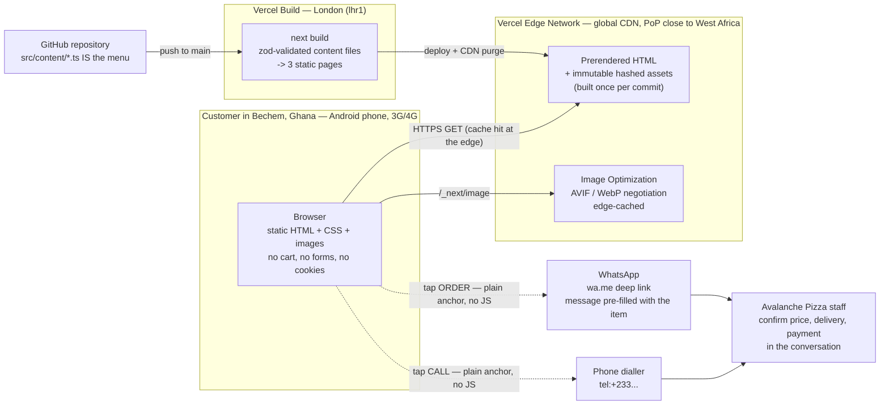

# Avalanche Pizza — Architecture Specification

**Status:** Draft **v2.1** — v2.0 amended on 2026-08-11 for the return of online ordering.
**Owner:** Frank (product); engineering executes.
**Market:** Bechem, Ahafo Region, Ghana — "premium tasty pizza in the heart of Bechem". **Hosting:** UK (Vercel, London `lhr1`). **Currency:** Ghanaian cedis, displayed as `Ghc` per the designs; `GHS` in machine-readable metadata.

This document is the single source of truth for the launch build. v2.0 superseded the v1.0 specification (cart, checkout, Supabase, accounts, order tracking, admin) after the owner descoped it on 2026-08-10 — [ADR-007](DECISIONS.md#adr-007-menu-site-with-ordering-by-whatsapp-and-phone), [ADR-008](DECISIONS.md#adr-008-no-database--menu-content-lives-in-the-repository).

> ### ⚠ v2.1 amendment — the scope boundary below has moved
>
> On 2026-08-11 the owner reinstated online ordering ([ADR-009](DECISIONS.md#adr-009-online-ordering-returns--mobile-money-first-via-paystack)) and then chose **Flutterwave with card payments enabled from launch** ([ADR-010](DECISIONS.md#adr-010-flutterwave-replaces-paystack-cards-enabled-from-launch)). **The v2.0 boundary is struck through below rather than deleted, so that the reversal is legible rather than invisible.**
>
> **Now in scope:** a basket, a checkout, server-side pricing, Flutterwave hosted payment, and two dynamic routes (`/api/payments/initiate`, `/api/payments/webhook`). Customer **name, phone and delivery zone** are collected and transmitted. Order records and a database follow (ADR-009) and are **not yet built**.
>
> **Still out of scope, and each for a stated reason:** customer accounts and passwords; any admin order board; any **card field or payment-provider script** — that one is prohibited outright, because the hosted redirect is what keeps PCI at SAQ-A (`docs/SECURITY.md` §2.2); order tracking beyond a reference; and delivery outside Bechem Town.
>
> **Unchanged and still load-bearing:** WhatsApp and `tel:` remain co-equal ordering routes — paying online is now an *option*, not a replacement. Browsing pages stay static. All money stays in integer pesewas. Design fidelity (ADR-006) is untouched.
>
> `docs/SECURITY.md` **v2.1 §C11** governs the payment channel; the sections it supersedes are marked there.

> ~~**Scope boundary — not negotiable, not reintroduced anywhere below.**~~ *(v2.0 — superseded by the amendment above.)*
> ~~No cart. No checkout. No online payment, Paystack, or payment webhooks. No customer accounts, order records, order tracking, or admin order board. No database and no Supabase. No customer personal data is collected, transmitted, or stored by this site — there is no form, no cookie, and no analytics that identifies a person.~~
> ~~What replaces all of it: **every order call-to-action is a WhatsApp deep link with a pre-filled message, with a `tel:` call link as the co-equal fallback.** The shop confirms price and delivery in the conversation.~~

All money is integer **pesewas** (1 GHS = 100 pesewas). All content is validated with **zod at build time**. TypeScript is `strict`.

---

## 1. System overview

Avalanche Pizza is a three-page static website. There is no server to run, no database to back up, no secret to rotate, no webhook to verify and no state to corrupt. A commit builds the site; Vercel's CDN serves it; the customer taps a link and lands in WhatsApp with their order already typed.



**Read the diagram for what is missing.** There is no application server on the request path, no database, no third-party API, no authentication, no session. The two dotted arrows leave our system entirely: once the customer taps, the transaction is a human conversation the shop already knows how to have.

### Why this is the right answer for this business

1. **It matches the designs that exist.** Four pages were designed; the ordering flow was not. Building a checkout would require inventing screens, which [ADR-006](DECISIONS.md#adr-006-design-fidelity--stitch-designs-are-used-as-is) forbids.
2. **It matches how Bechem already orders food.** WhatsApp and phone are the established channels. We are removing friction, not introducing a new habit.
3. **Bytes are money here.** A static site with no client-side state is the cheapest possible page for a customer paying per megabyte on MTN or Telecel data. Every kilobyte we do not ship is money we do not spend on the customer's behalf.
4. **A one-person shop cannot run a payment system.** Webhook reconciliation, refunds, failed-payment support and PCI posture are real operational load. Deleting them deletes the load.
5. **The failure modes shrink to almost nothing.** A static site's incident list is "Vercel is down" and "we published a wrong price". Both are covered in §11.
6. **Direct customer contact is a business asset, not a bug.** The shop gets a WhatsApp thread with every customer — upsells, repeat orders, delivery coordination — rather than an anonymous order row.

**Complete third-party surface at launch:** Vercel (hosting, CDN, image optimization, build) and GitHub (source, CI). Optionally Vercel Web Analytics (§8). Nothing else. No fonts CDN, no icon CDN, no tag manager, no chat widget.

### Repository structure

```
Avalanche-pizza-/
├── docs/
│   ├── ARCHITECTURE.md               # this document
│   ├── SECURITY.md                   # threat model, controls, privacy position
│   ├── DECISIONS.md                  # ADRs 001–008
│   └── runbooks/
│       └── EDITING-CONTENT.md        # the owner's menu-editing guide (§11)
├── design/                           # reference only — never imported (see CLAUDE.md)
│   ├── stitch-exports/*.html         # the four coded pages + previews/
│   ├── assets/                       # archived images + MANIFEST.md
│   └── design-system.md              # Avalanche Elite tokens
├── public/
│   ├── og/                           # og-home.jpg, og-menu.jpg, og-deals.jpg (JPEG, absolute-URL'd)
│   ├── icons/                        # favicon.ico, icon-192.png, icon-512.png, apple-icon.png
│   └── manifest.webmanifest
├── src/
│   ├── app/
│   │   ├── layout.tsx                # fonts, tokens, header/footer, Restaurant JSON-LD
│   │   ├── globals.css               # Tailwind v4 @theme — Avalanche Elite tokens
│   │   ├── page.tsx                  # Home                    -> /
│   │   ├── menu/page.tsx             # Core Menu               -> /menu
│   │   ├── deals/page.tsx            # Special Deals           -> /deals
│   │   ├── not-found.tsx             # 404 (composed only from existing components)
│   │   ├── robots.ts                 # -> /robots.txt
│   │   ├── sitemap.ts                # -> /sitemap.xml
│   │   ├── icon.png, apple-icon.png  # Next metadata file conventions
│   │   └── (login)/                  # NOT CREATED — owner decision pending, §2.3
│   ├── assets/images/                # the masters, statically imported (NOT in public/)
│   ├── components/
│   │   ├── layout/{SiteHeader,SiteFooter,PrimaryNav}.tsx
│   │   ├── ui/{Button,Badge,Tag,Icon,Photo}.tsx
│   │   ├── menu/{ProductCard,FeatureProductCard}.tsx
│   │   ├── deals/{DealHero,DealCard}.tsx
│   │   ├── order/{OrderCta,CallLink,IndicativePriceNote}.tsx   # THE ordering seam
│   │   └── seo/{RestaurantJsonLd,MenuJsonLd,DealsJsonLd}.tsx
│   ├── content/
│   │   ├── schema.ts                 # zod schemas + build-time invariants
│   │   ├── images.ts                 # ImageKey -> StaticImageData map
│   │   ├── menu.ts                   # categories + products + prices
│   │   ├── deals.ts                  # the five designed deal cards
│   │   ├── toppings.ts               # topping list for Free Choice
│   │   ├── home.ts                   # hero copy + featured product slugs
│   │   └── index.ts                  # parses everything, exports frozen typed data
│   ├── config/
│   │   └── shop.ts                   # WhatsApp number, phone, address, hours, socials
│   └── lib/
│       ├── whatsapp.ts               # link + message construction (unit-tested)
│       ├── phone.ts                  # Ghana E.164 normalization
│       ├── money.ts                  # formatPesewas()
│       └── metadata.ts               # shared Next Metadata builders
├── scripts/
│   ├── validate-content.ts           # zod parse + invariants (also runs inside the build)
│   ├── check-budgets.mjs             # JS/CSS/font byte gates from the build output
│   ├── assert-order-links.mjs        # every wa.me/tel: in emitted HTML == the configured number
│   └── make-og.mjs                   # sharp: existing photo -> 1200x630 JPEG (run on demand)
├── tests/
│   ├── unit/                         # whatsapp, phone, money, content invariants
│   └── e2e/                          # Playwright: throttled mobile, incl. a JS-disabled run
├── .github/workflows/ci.yml
├── lighthouse-budget.json
└── next.config.ts, vercel.json, tsconfig.json, playwright.config.ts, vitest.config.ts
```

There is deliberately **no `src/app/api/`, no `middleware.ts`, no `supabase/`, and no server action anywhere in the tree.** Their absence is a design constraint, and CI asserts it (§9).

---

## 2. Site map and routes

### 2.1 The hard rule

> **No route is created for which a Stitch design does not exist.**
> Exactly four pages were designed: Home, Core Menu, Special Deals, Login. Everything else in this table is a *structural* route — a file the web requires (404, `robots.txt`, `sitemap.xml`, icons, OG images) that renders no novel design and introduces no new page concept. If a future need arises for a page with content, the owner designs it first ([ADR-006](DECISIONS.md#adr-006-design-fidelity--stitch-designs-are-used-as-is)). An engineer may not invent one, and "composed from existing components" is not a licence to create a new page — only to render the 404 and the metadata assets listed below.

### 2.2 Designed pages

| Design (Stitch) | Route | File | Rendering | Notes |
|---|---|---|---|---|
| Home — *Avalanche Animated & Refined* | `/` | `src/app/page.tsx` | Static, prerendered | Hero + "Order Now"/"View Menu" CTAs, two featured products from `menu.ts`, the process section |
| Core Menu — *Cinematic Motion Edition* | `/menu` | `src/app/menu/page.tsx` | Static, prerendered | One flat bento grid of 11 products; **no category headings exist in the design** |
| Special Deals — *Cinematic Animated Edition* | `/deals` | `src/app/deals/page.tsx` | Static, prerendered | Party Feast hero + four deal cards in fixed layout slots |
| Login — *Split Layout Variant* | `/login` | **not created** | — | **Open item, §2.3** |

### 2.3 Open item — the Login page (owner decision, not ours)

The Login design exists and is faithful, but it has no function: with accounts removed there is nothing to authenticate. The route is **not built and not linked** until Frank decides. The options, with the trade-off stated plainly:

- **(A) Shelve the design.** The Stitch page and its export stay archived in `design/`; nothing ships. *Our recommendation, for one reason worth his attention:* a real-looking login form that authenticates nothing invites customers to type a password they use elsewhere into a dead input. That is a credential-harvesting shape with no attacker required, and it makes the site look phishy to anyone who inspects it. A page that cannot log anyone in should not look like it can. (`docs/SECURITY.md` control C4 reaches the same conclusion independently.)
- **(B) Build it as a static page.** Pixel-faithful, form inputs `disabled`, with a line explaining that accounts are coming. Costs ~half a day and one extra route in the sitemap; carries a milder version of the same confusion, and adds the only `<form>` on the site.
- **(C) Defer to a future phase.** Build it only when accounts have a purpose (see §13).

**We are not choosing.** Until Frank does, `/login` returns 404 and the header's Login control is handled per §2.5.

### 2.4 Structural routes (no design required)

| Route | File | Purpose |
|---|---|---|
| `/robots.txt` | `src/app/robots.ts` | `Allow: /` for all agents; points at the sitemap. Nothing here is private |
| `/sitemap.xml` | `src/app/sitemap.ts` | Generated from the route list; 3 URLs (4 if Login ships) with `lastModified` from the build |
| 404 | `src/app/not-found.tsx` | Existing header + footer, one Metrophobic headline, an `OrderCta` and a `CallLink`. Uses only existing components and tokens — no new layout |
| `/og/og-home.jpg`, `/og/og-menu.jpg`, `/og/og-deals.jpg` | `public/og/` | Static 1200×630 JPEGs derived from existing photography (§7) |
| `/icons/*`, `/favicon.ico`, `/apple-icon.png` | `public/icons/` + `src/app/icon.png` | Derived from `logo-new-3.png` |
| `/manifest.webmanifest` | `public/` | PWA manifest, no service worker (§6.6) |

### 2.5 Two navigation items in the designs have nowhere to go

The exported header (present on Home, Core Menu and Special Deals) contains five controls: **About Us**, **Core Menu**, **Deals**, a **basket icon with a `0` badge**, and a **Login** button. Three of the five are now problems, and each needs an explicit resolution before Stage 3 starts.

| Control | Problem | Resolution |
|---|---|---|
| **Core Menu**, **Deals** | none | Link to `/menu`, `/deals`. Active state = the designed 2px primary line above the label |
| **About Us** | The nav links to it; **no About Us page was ever designed** | **Omit the link.** A nav item that 404s is worse than a missing nav item, and building the page would be inventing a design. Flagged for Frank: if he wants About Us, he designs it |
| **Basket icon + `0` badge** | There is no cart | **Remove the control.** A basket that opens WhatsApp is a lie about what will happen, and a permanent `0` badge advertises an empty feature |
| **Login button** | §2.3 | Not rendered while the Login decision is open |

Removing three of five controls leaves the header's right-hand cluster empty, which is both a visual problem and a missed conversion. **Recommendation:** put a single **"Order on WhatsApp"** control in the slot the Login button occupied, reusing that button's exact designed treatment — 1px `outline` border, `label-caps` uppercase, `px-6 py-2`, primary fill on hover. This is not a new design; it is a designed component, in a designed slot, with different text. It still needs Frank's nod, because it changes what the header says. Listed with the other fidelity deviations in §6.7.

---

## 3. Menu content model

### 3.1 Decision: typed TypeScript modules, zod-parsed at build

The menu must be editable without a developer, and there is no database ([ADR-008](DECISIONS.md#adr-008-no-database--menu-content-lives-in-the-repository)). The content lives in `src/content/*.ts` as plain data objects, parsed by zod at module load — which happens during `next build`, so **malformed content cannot deploy; it fails the build.**

TypeScript modules rather than JSON or MDX, for three concrete reasons: JSON cannot carry comments (and a stray trailing comma is a hard parse error for an owner editing in a browser); MDX buys prose authoring we do not need for a price list; and TS gives the editor red squiggles plus a compile error in CI on a typo in a field name. MDX/JSON remain viable if the shape ever grows prose-heavy — the zod layer means the parser can change without the pages changing.

### 3.2 Money

Every price is an **integer number of pesewas**. `Ghc 28` is `2800`. Never a float, never a string, never a decimal.

```ts
// src/lib/money.ts
/** Pesewas -> the exact string the designs print: "Ghc 28", "Ghc 28.50", "Ghc 1,200". */
export function formatPesewas(pesewas: number): string {
  if (!Number.isInteger(pesewas) || pesewas < 0) {
    throw new TypeError(`formatPesewas expects non-negative integer pesewas, got ${pesewas}`);
  }
  const hasFraction = pesewas % 100 !== 0;
  const amount = new Intl.NumberFormat('en-GH', {
    minimumFractionDigits: hasFraction ? 2 : 0,
    maximumFractionDigits: hasFraction ? 2 : 0,
  }).format(pesewas / 100);
  return `Ghc ${amount}`;
}
```

`Ghc` (not `GH₵`, not `GHS`) because that is what the Core Menu and Special Deals designs print, and because it is pure ASCII — which matters when the same string is URL-encoded into a WhatsApp message (§4.4). `GHS` is used in structured data and `og:price:currency`, where a machine is reading.

### 3.3 Schemas

```ts
// src/content/schema.ts
import { z } from 'zod';
import { IMAGE_KEYS } from './images';

export const pesewas = z.number().int().nonnegative().max(1_000_000); // Ghc 10,000 sanity ceiling
export const slug = z.string().regex(/^[a-z0-9]+(?:-[a-z0-9]+)*$/, 'lowercase-hyphenated');
export const imageKey = z.enum(IMAGE_KEYS);           // union of the archived assets
export const altText = z.string().min(12).max(160);   // required: SEO + screen readers

/** Sizes exist in the model. Exactly one may ship — see the invariant below. */
export const sizeSchema = z.object({
  id: z.enum(['standard', 'medium', 'large', 'xl']),
  label: z.string().min(2).max(12),                   // "Standard" | "Medium" | "Large" | "XL"
  pricePesewas: pesewas,
});

export const categorySchema = z.object({
  id: slug,                                           // 'pizzas'
  name: z.string().min(2).max(30),
  order: z.number().int().nonnegative(),
});

export const productSchema = z.object({
  slug,                                               // 'the-avalanche' — stable id, used in Ref tags
  name: z.string().min(2).max(40),                    // "The Avalanche"
  description: z.string().min(20).max(320),
  categoryId: slug,
  sizes: z.array(sizeSchema).min(1),
  badge: z.enum(['signature', 'vegetarian', 'spicy']).optional(),
  tags: z.array(z.string().max(16)).max(2).default([]),   // Home cards render up to two
  image: imageKey,
  imageAlt: altText,
  /** Grid span in the designed bento layout. Changing this changes the page composition. */
  layout: z.enum(['feature', 'wide', 'standard']),
  /** Renders the "choose N toppings" WhatsApp template instead of the plain item template. */
  chooseToppings: z.number().int().min(1).max(8).optional(),
  available: z.boolean().default(true),
  order: z.number().int().nonnegative(),
});

export const dealSchema = z.object({
  slug,                                               // 'party-feast'
  name: z.string().min(2).max(40),                    // "The Party Feast"
  kicker: z.string().min(3).max(20),                  // "Mega Deal" | "Family Deal" | ...
  description: z.string().min(20).max(280),
  pricePesewas: pesewas,
  wasPricePesewas: pesewas.optional(),                // Party Feast: struck-through Ghc 120
  includes: z.array(z.string().min(3).max(60)).min(1).max(6),  // itemised into the WhatsApp message
  meta: z.array(z.object({ label: z.string().max(12), value: z.string().max(12) })).max(2).default([]),
  image: imageKey,
  imageAlt: altText,
  /** Fixed slot in the designed bento grid. Exactly one deal per slot. */
  slot: z.enum(['hero', 'mega', 'family', 'triple', 'party']),
  available: z.boolean().default(true),
});

export const toppingSchema = z.object({
  id: slug,
  name: z.string().min(2).max(20),                    // ASCII only — it goes into a URL
  available: z.boolean().default(true),
});
```

### 3.4 Build-time invariants

These are enforced in `src/content/index.ts` (so `next build` fails) and re-run standalone by `scripts/validate-content.ts` in CI:

| Invariant | Why |
|---|---|
| Every `slug` is unique across products, and across deals | Slugs are identifiers in `Ref:` tags and JSON-LD |
| Exactly **one** product has `layout: 'feature'` | The Core Menu bento reserves one 2×2 cell (The Avalanche) |
| Exactly **five** deals; exactly one per `slot` | The Special Deals grid has five fixed cells |
| `wasPricePesewas > pricePesewas` when present | A "discount" that is not one is a consumer-protection problem |
| **`sizes.length === 1` for every product** | *There is no size-selector design.* Rendering a second size would require inventing UI (ADR-006). The array shape is kept so the future model needs no migration; lifting this rule requires a design, not a code change |
| Only one category exists (`pizzas`) | The Core Menu design is a flat grid with no section headings. A second category has nowhere to render |
| Every `imageKey` resolves in `images.ts`, and every asset in `src/assets/images/` is referenced | Prevents orphan bytes and broken imports |
| `imageAlt` present and ≥ 12 chars everywhere | The Stitch exports carry `data-alt` (AI prompts), not real `alt`. Real alt text is authored content |
| Every product/deal name and topping name is ASCII | These strings are URL-encoded into WhatsApp messages (§4.4) |
| `home.featuredSlugs` all resolve to available products | Home's two feature cards read from `menu.ts` |

### 3.5 The content as it stands today

Transcribed verbatim from the exports and verified against their rendered text. **Prices are the designs' prices and must be confirmed by the owner before launch** (Stage 4, §12).

**`src/content/menu.ts` — 11 products, one category `pizzas`:**

| slug | name | Ghc | pesewas | badge | layout |
|---|---|---|---|---|---|
| `the-avalanche` | The Avalanche | 28 | 2800 | signature | `feature` |
| `margherita` | Margherita | 16 | 1600 | — | standard |
| `pepperoni` | Pepperoni | 19 | 1900 | — | standard |
| `chicken-feast` | Chicken Feast | 22 | 2200 | — | `wide` |
| `earths-bounty` | Earth's Bounty | 20 | 2000 | vegetarian ("Veg") | standard |
| `the-pacific` | The Pacific | 21 | 2100 | — | standard |
| `bbq-original` | BBQ Original | 20 | 2000 | — | `wide` |
| `spicy-beef-one` | Spicy Beef One | 21 | 2100 | — | standard |
| `free-choice` | Free Choice | 23 | 2300 | — | standard (`chooseToppings: 4`) |
| `all-4-one` | All 4 One | 25 | 2500 | — | standard |
| `classic` | Classic | 15 | 1500 | — | standard |

**`src/content/deals.ts` — the five cards the Special Deals page actually renders:**

| slot | slug | name | kicker | Ghc | was |
|---|---|---|---|---|---|
| `hero` | `party-feast` | The Party Feast | Elite Offer / Limited Time | 89 | 120 |
| `mega` | `the-summit` | The Summit | Mega Deal | 55 | — |
| `family` | `basecamp` | Basecamp | Family Deal (Serves 4-6, 25 Min) | 42 | — |
| `triple` | `the-ascent` | The Ascent | Triple Deal | 33 | — |
| `party` | `the-gathering` | The Gathering | Pizza Party | 65 | — |

> **Content discrepancy to resolve with the owner (not an architecture decision).** Earlier project notes named the five signature deals as *The Ascent, The Gathering, Party Feast, All 4 One, Free Choice* — a list inferred from the names of image assets. **The designed Special Deals page actually renders** *Party Feast, The Summit, Basecamp, The Ascent, The Gathering*, while **All 4 One (Ghc 25) and Free Choice (Ghc 23) are core-menu products** in the Core Menu design, each with its own card and price. The page text has been verified directly; this table is what is drawn.
> No invention is needed to resolve this: all seven names already have a designed home and a working WhatsApp CTA. Frank only needs to confirm that *Summit* and *Basecamp* are real offers and that *All 4 One* and *Free Choice* belong on the menu rather than the deals page. If he wants them moved, that is a content edit into the five fixed slots — not a new design.

**Home's two feature cards** (`src/content/home.ts`) reference `margherita` and `pepperoni` by slug and render name, price, description, badge and tags from `menu.ts`. The Home export hardcodes **"Classic Margherita — $18"** and **"Inferno Pepperoni — $22"** in **US dollars**, with different names and descriptions from the Core Menu. That is a defect in the design, not a spec: one product cannot have two prices in two currencies. **The Core Menu entry is the single source of truth**; Home renders `Margherita / Ghc 16` and `Pepperoni / Ghc 19`. Logged as a fidelity deviation in §6.7.

### 3.6 How the owner changes a price

1. Open `src/content/menu.ts` on github.com and click the pencil icon (works on a phone).
2. Change `pricePesewas: 1900` to `2100`. The comment beside every price reads `// Ghc 19.00`, so the arithmetic is never guesswork.
3. "Commit changes" → **Create a new branch and start a pull request**.
4. CI runs in ~90 seconds: types, zod validation, invariants, budgets, order-link assertion. Vercel posts a **preview URL** on the PR — the real site with the new price, viewable on his phone before anyone else sees it.
5. Merge. Production rebuilds and deploys in ~2 minutes. The CDN purges automatically; there is no cache to wait out.

Setting `available: false` on a sold-out item is the same flow and is the "86 board" this site needs. A full click-by-click version with screenshots ships as `docs/runbooks/EDITING-CONTENT.md` in Stage 4.

### 3.7 The honest trade-off, and the upgrade path

**What this costs.** Editing code files is not a CMS. The owner faces a diff view, YAML-shaped punctuation, and a pull request — three concepts a restaurant owner has no reason to know. A mistyped `pricePesewas: 190` (Ghc 1.90) is caught by no validator, only by the preview. Two people editing the same file at once produces a merge conflict he cannot resolve alone. And every change waits ~2 minutes for a build.

**What it buys.** Zero cost, zero third-party dependency, zero credentials to leak, complete version history with attribution, an instant one-click rollback, a preview of every change before it is public, and a menu that is part of the site's static build — which is exactly why the whole site is CDN-cacheable, which is exactly what makes it fast in Ghana. A CMS would put a database and an API call back on the request path we just removed.

**Named upgrade path, if the friction proves real.** Adopt **Sveltia CMS** (or **Decap CMS**, its longer-established predecessor) — a git-backed, single-page admin at `/admin` configured by one `config.yml`, authenticating through GitHub. The owner gets labelled form fields, an image picker and a Save button; behind it, the CMS commits to the same `src/content/` files and triggers the same build. **Nothing in this architecture changes** — no database appears, the content shapes are untouched, the site stays static. It is a bolt-on, deliberately deferred until we know whether it is needed. (Sanity, Contentful and friends are rejected for this shop: a monthly bill, an API on the critical path, and a vendor to be locked into, in exchange for editing a menu that changes a few times a year.)

---

## 4. The WhatsApp ordering mechanism

This is the product. Everything else on the site exists to get someone here.

### 4.1 The shop's number lives in exactly one place

```ts
// src/config/shop.ts — committed configuration, NOT an environment variable (§8)
export const SHOP = {
  /** E.164 with the leading '+'. THE single source for every order link on the site. */
  whatsappE164: '+233XXXXXXXXX',        // ← owner-supplied, Stage 4
  /** Rendered as visible text. Local presentation, for people who will dial it by hand. */
  phoneDisplay: '0XX XXX XXXX',
  addressLines: [
    'Bechem Community Centre',
    'Kwasu Road, Bechem',
    'Ahafo Region, Ghana',
  ],
  includeRefTag: true,                   // append "Ref: web/..." to messages (§4.3)
} as const;
```

Why committed rather than an environment variable: an env var can be changed in a dashboard by anyone with project access, silently, with no diff, no review and no history. This number is where customers' orders and money go. A change to it must appear in a pull request, be attributable to a person, and be reviewable. `CODEOWNERS` puts `src/config/**` behind the owner's review, and CI asserts that **every** `wa.me` and `tel:` link in every emitted HTML file resolves to this one value (§9) — which also catches a hardcoded number pasted into a component by mistake. `docs/SECURITY.md` control C3 layers a pinned test and an out-of-repo post-deploy check on top of this.

The value is shape-validated at module load: `/^\+233\d{9}$/`. CI cannot know the *correct* number, only that it is well-formed, consistent everywhere, and unchanged since the last human confirmed it — so the number is printed in the CI job summary and re-verified from a real phone in the pre-deploy checklist (§9).

### 4.2 Link construction

```ts
// src/lib/whatsapp.ts — pure, no I/O, no client bundle, exhaustively unit-tested
const WA_BASE = 'https://wa.me/';

/** wa.me takes digits only: no '+', no spaces, no dashes, no leading zero. */
const toWaDigits = (e164: string) => e164.replace(/^\+/, '');

export function buildWhatsAppUrl(message: string, e164: string = SHOP.whatsappE164): string {
  // encodeURIComponent — NOT encodeURI, NOT URLSearchParams. See §4.4.
  return `${WA_BASE}${toWaDigits(e164)}?text=${encodeURIComponent(message)}`;
}

export const buildTelUrl = (e164: string = SHOP.whatsappE164) => `tel:${e164}`;
```

```ts
// src/lib/phone.ts
/** '024 440 0000' | '0244400000' | '233244400000' | '+233244400000'  ->  '+233244400000' */
export function toE164Ghana(input: string): string {
  const s = input.replace(/[^\d+]/g, '');
  if (/^\+233\d{9}$/.test(s)) return s;
  if (/^233\d{9}$/.test(s))   return `+${s}`;
  if (/^0\d{9}$/.test(s))     return `+233${s.slice(1)}`;   // strip trunk '0', prepend country code
  throw new Error(`Not a valid Ghanaian MSISDN: ${input}`);
}
```

Ghana's national significant number is nine digits behind a trunk `0`, so a local `0244400000` (ten digits) becomes `+233244400000` (twelve digits) and `wa.me/233244400000`. A leading `0` left in place produces a valid-looking URL that reaches nobody — which is exactly the class of bug the E.164 helper and the CI assertion exist to kill.

### 4.3 Message templates

Four templates. Every one is plain ASCII, `\n`-separated, and follows one rule learned the hard way: **anything the customer must fill in goes last**, because WhatsApp places the caret at the end of the pre-filled text. A message that ends mid-thought is a message the customer completes in one tap.

**(a) Single item** — every Core Menu card, every Home feature card:

```
Hello Avalanche Pizza!

I would like to order:
1 x Pepperoni - Ghc 19

Please confirm the price and delivery to my location.

Ref: web/menu/pepperoni
```

A size parenthetical — `1 x Pepperoni (Large)` — appears only when the size label is not `Standard`. The `Ref:` line gives the shop free attribution — which page, which item — with no tracking script, no cookie and no personal data; `SHOP.includeRefTag = false` removes it everywhere in one edit.

**(b) Item with toppings** — the `chooseToppings` template, used by Free Choice:

```
Hello Avalanche Pizza!

I would like to order:
1 x Free Choice - Ghc 23

Please confirm the price and delivery to my location.

Toppings available: Pepperoni, Beef, Chicken, Mushroom, Onion, Green Pepper, Sweetcorn, Pineapple, Jalapeno, Olives
My 4 toppings are:
```

The topping list comes from `toppings.ts` (available only). The caret lands after `are:`. This is how the site handles a "choose any 4 toppings" product with no topping-picker design: the choice moves into the conversation, where it always ended up anyway. Longest message on the site — about 450 characters encoded, well inside every limit.

**(c) Deal** — the hero and all four deal cards:

```
Hello Avalanche Pizza!

I would like The Party Feast deal - Ghc 89.
Includes: 4 large pizzas, 3 boxes of wings, sides

Please confirm the price and delivery to my location.

Ref: web/deals/party-feast
```

`Includes:` is `deal.includes` joined with `", "`, so the shop reads back exactly what the customer was shown.

**(d) General** — the Home hero "Order Now", the Deals page "Start Your Order", the header CTA, the 404:

```
Hello Avalanche Pizza!

I would like to place an order. Please can you help me choose?

Ref: web/home/hero
```

### 4.4 Encoding pitfalls — the list of ways this breaks

Every one of these is a real failure mode, and each is covered by a unit test.

| Pitfall | Consequence | Rule |
|---|---|---|
| `URLSearchParams` or manual `+` for spaces | WhatsApp renders literal `+` between every word: `I+would+like+to+order` | **Never** use `URLSearchParams`. `encodeURIComponent` yields `%20`, which WhatsApp renders as a space |
| `encodeURI` instead of `encodeURIComponent` | `encodeURI` leaves `&`, `?`, `#`, `+` intact. A product named "Chicken & Cheese" silently truncates the message at the `&`; a `#` drops everything after it into the URL fragment | Always `encodeURIComponent` on the message, never on the assembled URL |
| Windows line endings | `\r\n` → `%0D%0A` renders a stray blank line on several Android clients | `\n` only. Templates are built with `join('\n')`, never with editor-authored multi-line strings |
| The cedi sign `₵` (U+20B5) | Three bytes as `%E2%82%B5`; renders as a box on older Android font stacks | `Ghc`, which is also what the designs print |
| Typographic punctuation — `—`, `’`, `“ ”` | Multi-byte, and copy-pasted by staff into replies where they render inconsistently | ASCII `-` and `'` in all content that reaches a message. Enforced by the ASCII invariant in §3.4 |
| Emoji | Multi-byte; ZWJ sequences have been mangled by older WhatsApp Android builds and inflate every anchor's `href` in the HTML — 11 links on the menu page pay the cost | **No emoji in generated messages.** If ever wanted, single-codepoint only, and only on the general CTA |
| Very long messages | Some clients truncate the prefill; browsers cap URLs around 2,000 characters | Cap the built URL at 1,800 chars in `buildWhatsAppUrl`, throwing at build time. Our longest is ~450 |
| Building the `href` in a click handler | Breaks with JS disabled or still loading — the exact conditions our customers face | The `href` is server-rendered into the HTML. There is no `onClick` anywhere in the ordering path |

### 4.5 Mobile versus desktop

`https://wa.me/<digits>?text=<encoded>` is WhatsApp's documented universal link and handles both, which is precisely why we use one URL form everywhere:

- **Mobile (the overwhelming majority).** Android App Links / iOS Universal Links hand the URL straight to the installed app; the chat opens with the message typed and unsent. The customer reads it, edits it if they want, and hits send. Nothing is sent on their behalf.
- **Desktop.** `wa.me` serves an interstitial that opens the WhatsApp desktop app via its protocol handler, or `web.whatsapp.com/send?phone=…&text=…`. If the visitor has no WhatsApp Web session they meet the QR-code page, and the prefill may not survive the login.

**Rejected: sniffing the user agent to emit `web.whatsapp.com/send` on desktop.** It requires either JavaScript (which must not be on this path) or request-time rendering (which de-statics the entire site), to marginally improve the experience of a small minority on a mobile-first site — while `wa.me` already handles them. `api.whatsapp.com/send?phone=` is the equivalent older form; we standardise on `wa.me` and use nothing else, so there is exactly one URL shape for CI to assert against.

The desktop gap is closed by the same thing that closes every other gap: **the phone number is always visible as text.**

### 4.6 The `tel:` fallback, and when to show it

`tel:` links carry the **full E.164 with the `+`** — `tel:+233244400000` — unlike `wa.me`, which wants bare digits. Getting this backwards is a classic bug, so the two builders are separate functions with separate tests.

Placement rule:

| Location | WhatsApp | `tel:` | Number as visible text |
|---|---|---|---|
| Header CTA | yes | — | — |
| Home hero, Deals "Start Your Order", 404 | yes | **yes, co-equal** — same size, same weight, adjacent | — |
| Per-item cards (menu, deals, Home features) | yes | no | — |
| Footer, every page | yes | **yes** | **yes — selectable, next to the address** |

Per-item cards carry WhatsApp only, because the item-level prefill is the entire point of that link and because the designed cards have exactly one button slot. A customer who wants to call is one scroll from the footer, and the page-level CTA blocks give them a co-equal call button on every page.

The footer renders the number as **plain selectable text** as well as a link. That single detail covers the desktop visitor with no WhatsApp Web session, the customer on a phone without WhatsApp installed, the person writing it on paper, and anyone whose browser does not register a `tel:` handler.

### 4.7 When WhatsApp is not installed

`wa.me` renders WhatsApp's own fallback page — "Continue to Chat", with a link to Play Store or App Store. That is a good fallback and it is not ours to improve on.

**We add no detection.** The `setTimeout`-and-check-`document.hidden` trick used to detect a failed app launch is unreliable across Android browsers, costs client JavaScript on the one path that must never depend on it, and produces false positives that hijack customers who *did* successfully open WhatsApp. The visible phone number and the `tel:` link are the fallback, and they work in every case including the ones we cannot detect.

### 4.8 Prices are indicative

Every page that prints a price carries a short, permanent line in the shop's voice — rendered by `<IndicativePriceNote />`, styled `label-caps` in `on-surface-variant`, placed under the menu grid, under the deals grid, and in the footer:

> Prices shown are a guide. We will confirm the final price and delivery in your WhatsApp chat before you pay.

This is a launch requirement, not a nicety ([ADR-007](DECISIONS.md#adr-007-menu-site-with-ordering-by-whatsapp-and-phone)), and `docs/SECURITY.md` §4.6 ties it to Act 772 vendor-disclosure duties. The shop cannot control delivery distance, availability, or how quickly ingredient costs move, and a site that prints a number it will not honour is a complaint waiting to happen. The same sentence — worded for the chat — is also the closing line of every pre-filled message: *"Please confirm the price and delivery to my location."*

---

## 5. Rendering, caching and delivery

### 5.1 Decision: all pages prerendered at build. No ISR. No revalidation.

Every route sets `export const dynamic = 'force-static'`. `next build` produces three HTML files; Vercel serves them from the CDN edge.

**ISR is rejected, and the reason is structural rather than a matter of taste.** Incremental Static Regeneration exists to refresh pages whose content changes independently of deployments — a CMS edit, a database write, an upstream API. Here, content changes *are* deployments: the menu is a file in the repository, so a price change is a commit, and a commit already rebuilds and redeploys the whole site in about two minutes. Adding `revalidate` to that would introduce a window in which the CDN knowingly serves a stale price, plus a serverless invocation and a cache-state machine to reason about — pure cost, zero benefit. **The build is the revalidation.**

**`output: 'export'` (fully static file export) was seriously considered and rejected**, for one concrete reason: it disables Vercel's Image Optimization, so we would hand-roll an AVIF/WebP pipeline with `sharp` and `<picture>` to get back what `next/image` gives us for free — the single most valuable thing on a Ghanaian connection. Response headers would also move to `vercel.json` (a point `docs/SECURITY.md` C5 makes independently). Worth recording that nothing in this design *depends* on a server, so the option stays open: if we ever leave Vercel, the site becomes a folder of files and the only work is the image pipeline.

### 5.2 What is dynamic

Nothing.

Zero route handlers, zero server actions, zero `middleware.ts`, zero cookies, zero request-time rendering. The only compute Vercel performs per request is image optimization, and that is edge-cached after the first hit per variant. CI asserts the absence (§9) — this is a property that erodes quietly, one convenience at a time.

A consequence worth stating plainly: with no functions on the request path, **the `lhr1` region pin is now almost decorative.** It is retained because [ADR-003](DECISIONS.md#adr-003-nextjs-on-vercel-pinned-to-uk-regions) fixes the hosting jurisdiction and it governs the build and the image optimizer, but Ghanaian visitors are served by the nearest CDN PoP and never pay a London round trip for a page.

### 5.3 Cache headers

| Asset | `Cache-Control` | Set by |
|---|---|---|
| HTML (`/`, `/menu`, `/deals`, 404) | `public, max-age=0, must-revalidate` | Vercel default — **do not override** |
| `/_next/static/**` (JS, CSS, fonts, hashed images) | `public, max-age=31536000, immutable` | Vercel default |
| `/_next/image?...` (optimized images) | long-lived, keyed on `url+w+q` | `images.minimumCacheTTL = 31536000` in `next.config.ts` |
| `/og/*.jpg`, `/icons/*` | `public, max-age=31536000, immutable` | `headers()` in `next.config.ts` |
| `/manifest.webmanifest`, `/robots.txt`, `/sitemap.xml` | `public, max-age=3600` | `headers()` |

**Never put a browser `max-age` on the HTML.** A stale price is the one cache bug this business cannot absorb, and the CDN already holds the HTML and purges it on deploy — so the customer gets an edge-speed response *and* the current menu. Repeat visitors revalidate the HTML (a ~200-byte 304) and re-use everything else from disk, which is why a second visit costs about 25 KB.

Immutable image caching means **a changed photograph must get a new filename.** Static imports hash the filename automatically for `/_next/static/media/*`; the rule only binds `public/og/*`, where `make-og.mjs` writes `og-menu-2.jpg` rather than overwriting. This is documented in the content runbook because WhatsApp caches previews aggressively (§7.4).

### 5.4 Security headers

Set once in `next.config.ts` `headers()` for `/:path*`. **`docs/SECURITY.md` control C5 is authoritative** for the exact policy — including the inline-script hash allowlist, the `style-src` reasoning, and the build-output origin allowlist. Summarised here for architectural context:

```
Strict-Transport-Security: max-age=63072000; includeSubDomains; preload
X-Content-Type-Options: nosniff
X-Frame-Options: DENY
Referrer-Policy: no-referrer
Permissions-Policy: camera=(), microphone=(), geolocation=(), payment=(), usb=()
Content-Security-Policy: default-src 'none'; script-src 'self' <pinned hashes>;
  style-src 'self' 'unsafe-inline'; img-src 'self' data:; font-src 'self'; connect-src 'self';
  manifest-src 'self'; form-action 'none'; frame-ancestors 'none'; base-uri 'none';
  object-src 'none'; upgrade-insecure-requests
```

The trade worth naming architecturally: this site has **no form, no user input, no cookie, no session and no third-party script**, so the injection surface is the content files themselves — which are code-reviewed. `form-action 'none'` is exact today and must be revisited if the Login page ever ships. `connect-src` gains Vercel's insights endpoint if Web Analytics is enabled (§8).

---

## 6. Ghana performance strategy

**This is the most important section in the document.** The customer is on a mid-range Android phone, on MTN or Telecel data bought in bundles, in a place where a 500 KB page is a purchase decision. Every budget below is enforced in CI (§9) and fails the build. They are limits, not aspirations.

### 6.1 Page-weight and JavaScript budgets

Compressed transfer, first visit, cold cache. "Initial" is what loads before any scroll on a 375×812 viewport; "full scroll" is everything including lazy images.

| Page | HTML (br) | CSS | JS first-load (gz) | Fonts | Images (initial) | **Initial total** | Full scroll |
|---|---|---|---|---|---|---|---|
| `/` Home | ≤ 16 KB | ≤ 12 KB | ≤ 100 KB | ≤ 80 KB | ≤ 45 KB | **≤ 250 KB** | ≤ 380 KB |
| `/menu` Core Menu | ≤ 22 KB | ≤ 12 KB | ≤ 100 KB | ≤ 80 KB | ≤ 60 KB | **≤ 275 KB** | ≤ 520 KB |
| `/deals` Special Deals | ≤ 18 KB | ≤ 12 KB | ≤ 100 KB | ≤ 80 KB | ≤ 45 KB | **≤ 250 KB** | ≤ 400 KB |
| Any page, repeat visit | 304 | cached | cached | cached | cached | **≤ 25 KB** | — |

Field targets on throttled 4G: **LCP ≤ 2.5 s, CLS ≤ 0.05, TBT ≤ 100 ms, Lighthouse mobile performance ≥ 95** on all three pages.

The fonts (~80 KB) are the largest single item and are shared across all pages and immutably cached — paid once, then never again. Core Menu's full-scroll figure is the honest cost of eleven food photographs, and it is *pay-as-you-scroll*: a customer who looks at the top four cards and taps Order never downloads the other seven.

**JavaScript: the target is zero.** Not "small" — zero application JavaScript. All three pages are React Server Components rendering static markup; there is no client state, no interactivity beyond links, and nothing to hydrate. The ~100 KB budget is the Next.js App Router baseline runtime, and CI enforces the thing that actually matters:

```
grep -rl '"use client"' src/  →  must return nothing
```

with an empty allowlist. The day someone needs a client component, that grep fails and the trade-off gets discussed in a pull request instead of appearing in a bundle. If the baseline ever becomes the dominant cost, the escape hatch is `output: 'export'` plus stripping the router — noted, not taken.

### 6.2 Image pipeline

**The masters are native-resolution as of 2026-08-11.** The original archive was captured at Stitch's 512 px default; the owner mandated ultra-high-resolution imagery, and every shipping asset was re-pulled from the same source URLs at full size — wide shots at 1408×768, square food photography and portraits at 1024×1024, the signature hero at 1264×848. Same images, more pixels (ADR-006 holds: nothing regenerated). Icons remain 48 px; the `design/` archive keeps the 512 px capture as the historical record.

**Delivery.** All masters live in `src/assets/images/` and are **statically imported** (not placed in `public/`). Static imports buy four things at once: intrinsic `width`/`height` (so nothing shifts, CLS ≈ 0), an automatically generated `blurDataURL`, a content-hashed emitted filename (immutable caching, safe replacement), and a build error rather than a 404 if a file is renamed. `src/content/images.ts` maps `ImageKey → StaticImageData`, so content files stay pure data.

`next/image` handles negotiation: **AVIF first, WebP second, original as floor.** Dark, high-contrast food photography is the ideal AVIF case — large flat near-black regions compress to almost nothing while the highlights stay clean.

```ts
// next.config.ts
images: {
  formats: ['image/avif', 'image/webp'],
  deviceSizes: [512, 640, 828, 1080, 1440, 1920],
  imageSizes: [64, 96, 128, 192, 256, 384],
  qualities: [62, 75, 85],   // 75 = default (cards); 85 = heroes/portraits; 62 reserved for Save-Data
  minimumCacheTTL: 31_536_000,
}
```

The optimizer never upscales past a source's native width, so the top rungs are safe by construction: a request for `w=1920` against a 1408 px master returns 1408 real pixels, not a stretched fake. Heroes and portraits pass `quality={85}` explicitly; menu cards ride the 75 default. **Superseded 2026-08-11:** the original 512 px `deviceSizes` cap and q62 ceiling — and the per-image byte ceilings below — were budget decisions made when the masters themselves were 512 px thumbnails. The owner chose image fidelity over those byte targets once full-resolution masters became available; the Stage 5 budget gates must be recalibrated against the new reality rather than enforcing the old table.

**Per-image ceilings, measured on the emitted AVIF:**

| Role | Rendered at | Request width | Ceiling |
|---|---|---|---|
| Hero (Home, Deals) | full-bleed | 512 | **40 KB** |
| Product card (Core Menu) | ~340–390 px | 384 | **30 KB** |
| Feature card (The Avalanche, Home features) | ~512 px | 512 | **38 KB** |
| Deal card | ~400 px | 512 | **35 KB** |
| Process-section images (Home) | ~256 px | 256 | **20 KB** |
| Logo (header + footer) | 32 px tall | 96 | **8 KB** — alpha preserved for `mix-blend-mode: screen` |
| Social icons (48×48 PNG) | 24 px | 48 | **2 KB** each |

`avalanche-party.png` is a **285 KB PNG of a photograph** — the heaviest asset in the project by a factor of two, and a lossless format holding lossy content. It converts to AVIF at roughly 25 KB.

**`sizes` is mandatory on every image.** Without it the browser assumes `100vw` and downloads the largest candidate for a card that renders at a third of the screen:

```tsx
// Core Menu product card: 1 col mobile, 2 col md, 4 col lg (max container 1280 + 24px gutters)
sizes="(max-width: 767px) 100vw, (max-width: 1023px) 50vw, 320px"
// Home hero, Deals hero
sizes="100vw"
// Home process grid
sizes="(max-width: 1023px) 50vw, 256px"
```

**Blur placeholders, used selectively.** `placeholder="blur"` inlines ~700–1000 bytes of base64 into the HTML *per image*. On Core Menu that is ~10 KB of inline payload for eleven images, most of them below the fold and invisible during load. So: **blur on above-the-fold images only** (hero, the first two menu cards, the deal hero); everything else gets a flat `background-color: #1c1b1b` — `surface-container-low`, already in the design — which costs zero bytes and looks identical on a dark page. Exactly one image per page carries `priority` (the LCP element); everything else is `loading="lazy" decoding="async"`.

**`Save-Data` — the honest answer.** A fully static site cannot vary its HTML on a request header without a middleware function on every request, and `next/image` keys its cache on `url+w+q` only. Three options were weighed:

- *Middleware negotiating on `Save-Data: on`* — **rejected.** It puts a serverless function on every request, de-statics the entire site and adds a London round trip to Ghana, to save perhaps 40 KB on a page already engineered down to 250 KB. The cure costs more than the disease.
- *Client-side `navigator.connection.saveData`* — **rejected.** Requires JavaScript, and by the time it runs the images are already in flight.
- *Engineer the default so a data-saving user is already well served, and use `@media (prefers-reduced-data: reduce)` in CSS where it is free* — **adopted.** Decorative background imagery, the hero's scale transform and the Home process-grid photographs collapse to flat token surfaces under that query. Support is currently limited to Chromium behind a flag, so this is progressive enhancement and is described as such rather than counted on.

The real Save-Data strategy is the budget table. A page that is 250 KB for everyone does not need a degraded mode.

### 6.3 Fonts

**Total font budget: ≤ 80 KB across all three families, ≤ 4 files, zero external requests.**

`next/font/google` self-hosts at build time — no `fonts.googleapis.com` connection, no third-party origin in the CSP, no extra DNS+TLS handshake on a high-latency link, and automatic `size-adjust` fallback metrics that hold CLS at zero. (This is also a privacy control — see `docs/SECURITY.md` §4.4.)

| Family | Role | Config | Budget |
|---|---|---|---|
| **Metrophobic** | display / headlines / nav | 400, `subsets: ['latin']`, `display: 'swap'`, **preloaded** | ≤ 16 KB |
| **Manrope** | body / UI | variable, `subsets: ['latin']`, `display: 'swap'`, **preloaded** | ≤ 30 KB |
| **JetBrains Mono** | `label-caps` — badges, tags, prices | 500, `subsets: ['latin']`, `display: 'swap'`, not preloaded | ≤ 30 KB |

Only two families are preloaded; a third preload competes with the LCP image for early bandwidth. JetBrains Mono swaps in on small labels where the reflow is imperceptible, and it is the designated first cut if the budget is ever breached (labels fall back to Manrope with the same tracking — a deviation the owner would need to accept).

Custom glyph subsetting via `glyphhanger` would save perhaps 20 KB and is **rejected**: the glyph set depends on menu content the owner edits, so a subset generated today silently drops a character he types tomorrow. Wrong risk for the saving.

**Delete the Material Symbols icon font.** All four exports load Google's Material Symbols Outlined variable font — hundreds of kilobytes, from a third-party origin, blocking, for **twelve glyphs**: `add`, `shopping_basket`, `add_shopping_cart`, `arrow_forward`, `arrow_right_alt`, `east`, `restaurant`, `local_fire_department`, `celebration`, `architecture`, `filter_3`, `login`, `language`. Several of those belong to controls we are removing anyway (basket, cart, login). The survivors ship as an inline SVG sprite of the same open-source glyphs — around 1.5 KB total, inlined, no request, no FOIT, and `currentColor`-aware. **This is the single largest performance win available on this site**, and it also removes an entire third-party origin from the CSP.

Likewise, `cdn.tailwindcss.com` (the Play CDN the exports use) never ships. Tailwind v4 compiles at build, with the Avalanche Elite tokens declared in `globals.css` under `@theme` — using the same custom names the exports already reference (`--color-surface-container`, `--font-label-caps`, `--text-display-lg`, `--spacing-margin-desktop`), so the exported class strings largely survive conversion intact.

### 6.4 With JavaScript disabled, broken, or still loading

**The site is fully functional with JavaScript disabled.** Not degraded — functional. This is a hard requirement and a tested one (§10).

- Every ordering CTA is a plain `<a href="https://wa.me/…?text=…">`, server-rendered, with the message already encoded in the markup. No `onClick`, no `router.push`, no event delegation, no `<button>` pretending to be a link.
- Every call CTA is a plain `<a href="tel:+233…">`.
- Navigation is plain `<Link>` (which renders a plain `<a>` and works without hydration).
- All content — prices, descriptions, images, structured data — is in the HTML.
- The 404, the footer, the address and the phone number all render server-side.

This is not defensive theatre. On a congested 3G cell, JavaScript frequently arrives late or not at all; a customer who can tap Order while the bundle is still downloading is a customer who ordered.

The scroll-reveal animations in the exports are driven by `IntersectionObserver` in an inline `<script>`. Reproducing them as-is would mean the site's content is **invisible** (`opacity: 0`) until JavaScript runs — a catastrophic failure mode dressed as a nicety. They are rebuilt as pure CSS animations that start from the visible state and animate *in*, wrapped in `@media (prefers-reduced-motion: no-preference)` exactly as the exports intend. The mouse-spotlight and parallax effects on Core Menu and Special Deals are dropped (pointer-only, meaningless on touch, and they would cost the site's only client component plus a scroll listener). Both are listed in §6.7.

### 6.5 Response compression

Brotli, applied automatically by Vercel to HTML, CSS, JS and SVG. AVIF and WebP are already compressed and are not double-encoded. Nothing to configure; noted so it is not re-litigated.

### 6.6 PWA — decision: ship the manifest, do not ship a service worker

**Manifest: yes.** `public/manifest.webmanifest` with `name`, `short_name: "Avalanche"`, `start_url: "/"`, `display: "standalone"`, `background_color: "#131313"`, `theme_color: "#131313"`, and the icons we need for favicons regardless. Cost is roughly 1 KB and no runtime code. It buys a proper icon and name when a repeat customer adds the site to their Android home screen, and `theme_color` tints the browser chrome to match the brand — a genuinely premium detail for nothing.

**Service worker: no.** Offline browsing of a menu you cannot order from is not a coherent feature; a customer offline cannot reach WhatsApp either. Against that, a service worker adds a cache-invalidation surface that can serve a stale *price* to a returning customer long after the deploy that fixed it — the one bug this business must not have. Immutable HTTP caching already makes a repeat visit ~25 KB. Revisit only if the shop later wants an installable ordering app, which is a different product.

### 6.7 Fidelity deviations requiring the owner's acknowledgement

[ADR-006](DECISIONS.md#adr-006-design-fidelity--stitch-designs-are-used-as-is) binds us to the designs as drawn. The following departures are unavoidable, motion-or-content rather than composition, or forced by the descope. **Every one is listed here so Frank approves them explicitly rather than discovering them.**

| # | Deviation | Why |
|---|---|---|
| 1 | Basket icon and `0` badge removed from the header | There is no cart (§2.5) |
| 2 | Login button not rendered | Open item (§2.3) |
| 3 | "About Us" nav link omitted | No such page was designed; the link would 404 (§2.5) |
| 4 | An "Order on WhatsApp" control occupies the Login slot, reusing that button's exact styling | Otherwise the header's right cluster is empty and the primary action is missing above the fold (§2.5) |
| 5 | "Add to Basket" / "Add Item" / "Add to Cart" / "Initiate Order" / "Select →" / "Claim Feast" button **labels** change to order-on-WhatsApp wording; button geometry, colour and type are untouched | The buttons no longer add to a basket. Exact wording is Frank's to choose |
| 6 | Home's feature cards show `Margherita / Ghc 16` and `Pepperoni / Ghc 19` instead of `Classic Margherita / $18` and `Inferno Pepperoni / $22` | The design prints US dollars and different names for products the Core Menu prices in cedis. One product cannot have two prices (§3.5) |
| 7 | Badge treatment is unified from one `badge` field per product | Home badges Margherita; the Core Menu card does not. One source of truth per product, rendered wherever the design has a badge slot |
| 8 | Material Symbols webfont replaced by an inline SVG sprite of the same glyphs | Hundreds of KB from a third-party origin for twelve icons (§6.3) |
| 9 | Scroll reveals rebuilt in CSS, starting visible; mouse-spotlight and parallax dropped | Content must never be `opacity: 0` pending JavaScript; pointer effects are meaningless on touch (§6.4) |
| 10 | `::-webkit-scrollbar { display: none }` not carried over | Hiding the scrollbar removes a scroll affordance and position cue; an accessibility regression for no visual gain on a dark page |
| 11 | Desktop-only exports are made responsive | Expected and already anticipated by [ADR-005](DECISIONS.md#adr-005-google-stitch-is-the-design-source-of-truth); layout adapts, appearance does not |
| 12 | Hero imagery is upscaled from 512 px masters | No higher-resolution source exists (§6.2). Resolvable only by Frank supplying originals |

---

## 7. Discoverability

This site has one job: be found by someone in Bechem who wants pizza, and turn that visit into a WhatsApp message. Discoverability is not a polish task here — it is the product's distribution.

### 7.1 Metadata

`metadataBase` is set from `NEXT_PUBLIC_SITE_URL` in the root layout, which makes every OG and canonical URL absolute (a hard requirement for the WhatsApp crawler). `src/lib/metadata.ts` builds each page's object.

| | Content |
|---|---|
| Title template | `%s \| Avalanche Pizza` — Home overrides to `Avalanche Pizza — Premium Tasty Pizza in Bechem` |
| `/menu` | `Core Menu` · *"Wood-fired pizza in Bechem, from Ghc 15. Order on WhatsApp — Margherita, Pepperoni, The Avalanche and more."* |
| `/deals` | `Special Deals` · *"Party Feast Ghc 89, The Gathering Ghc 65, The Ascent Ghc 33. Order on WhatsApp from Avalanche Pizza, Bechem."* |
| Descriptions | ≤ 155 chars, each naming **Bechem**, a **price** and **WhatsApp** |
| `alternates.canonical` | Self-referencing on every page |
| `openGraph` | `type: website`, `siteName: Avalanche Pizza`, `locale: en_GH`, absolute `url`, per-page `images` |
| `twitter` | `summary_large_image` (also consumed by several other link unfurlers) |
| `robots` | `index, follow`, `max-image-preview: large` |
| `<html lang="en-GH">` | Ghanaian English |

### 7.2 Structured data

Server-rendered JSON-LD in `<script type="application/ld+json">` — no client JavaScript, no third-party tag.

**`Restaurant` (root layout, every page)** — the anchor for the Google knowledge panel and local pack:

```jsonc
{
  "@context": "https://schema.org",
  "@type": "Restaurant",
  "@id": "https://<domain>/#restaurant",
  "name": "Avalanche Pizza",
  "description": "Premium tasty pizza in the heart of Bechem.",
  "servesCuisine": ["Pizza", "Italian"],
  "priceRange": "GHS 15–89",
  "currenciesAccepted": "GHS",
  "url": "https://<domain>/",
  "telephone": "+233XXXXXXXXX",
  "image": "https://<domain>/og/og-home.jpg",
  "logo": "https://<domain>/icons/icon-512.png",
  "address": {
    "@type": "PostalAddress",
    "streetAddress": "Bechem Community Centre, along Kwasu Road",
    "addressLocality": "Bechem",
    "addressRegion": "Ahafo",
    "addressCountry": "GH"
  },
  "geo": { "@type": "GeoCoordinates", "latitude": 0, "longitude": 0 },   // owner input
  "openingHoursSpecification": [ /* owner input */ ],
  "hasMenu": "https://<domain>/menu",
  "acceptsReservations": false,
  "sameAs": [ /* Facebook, Instagram, TikTok — owner input */ ]
}
```

**`Menu` → `MenuSection` → `MenuItem` (`/menu`)** — each item carries `name`, `description`, `image` and an `Offer` with `price` (decimal cedis, derived from pesewas) and `priceCurrency: "GHS"`. **`OfferCatalog` of `Offer` (`/deals`)** — deals with `price`, `priceCurrency`, and `priceValidUntil` omitted rather than invented.

Deliberately **not** emitted: `OrderAction`, `potentialAction` or any `orderUrl`. Those declare that the site takes orders. It does not, and telling Google otherwise invites a rich result that lies to the customer.

Honest expectation-setting: Google renders limited rich results for restaurant menus. The value of this markup is feeding the **local knowledge panel** with correct name, address, phone and hours — which is what a Bechem search actually surfaces. Validated with the Rich Results Test before launch.

### 7.3 Sitemap and robots

`src/app/sitemap.ts` emits the three (or four) canonical URLs with `lastModified` from the build timestamp, `changeFrequency: 'monthly'`, `priority` 1.0 / 0.9 / 0.9. `src/app/robots.ts` allows everything and points at the sitemap — nothing on this site is private, and a `Disallow` here would only risk hiding the menu. Submitted once to Google Search Console.

### 7.4 OpenGraph images — critical, because links get shared *in* WhatsApp

The dominant sharing path for this business is a customer forwarding the link into a family group chat. That preview card **is** the advertisement, and WhatsApp's crawler is stricter than most:

| Rule | Reason |
|---|---|
| **JPEG or PNG only** — never AVIF, never WebP | WhatsApp's crawler does not render them; the preview silently falls back to text |
| **Serve as a static file from `public/og/`, absolute URL, no query string** | Never `/_next/image?url=…`, which content-negotiates AVIF and needs an optimizer round trip the crawler will not wait for |
| **≤ 200 KB** | Above roughly 300 KB WhatsApp downgrades the large card to a small square thumbnail. We target 150 KB |
| **1200×630, with `og:image:width` and `og:image:height` declared** | The explicit dimensions are what makes WhatsApp choose the large card over the thumbnail |
| **`og:title` ≤ 65 chars, `og:description` ≤ 155** | Both are truncated in the chat bubble |
| **OG tags early in `<head>`** | The crawler reads only the head of the document. Next's metadata API handles this |
| **Change the filename to bust the preview cache** | WhatsApp caches per-URL, aggressively and for a long time. `og-menu.jpg` → `og-menu-2.jpg`, documented in the content runbook |

`scripts/make-og.mjs` produces the three images with `sharp` from **existing** photography — `avalanche-signature-hero.jpg` for Home, `pizza-margherita-classic.jpg` for the menu, `deal-party-feast.jpg` for deals — cropped to 1.91:1, resized to 1200×630 with `lanczos3`, mild sharpening, JPEG q72. The 512 px masters are upscaled, which is fine: WhatsApp renders the card at roughly 400 px wide, so the artefacts are invisible, while declaring 1200×630 maximises the chance of the large format. No new imagery is created — these are crops of assets already in the project ([ADR-006](DECISIONS.md#adr-006-design-fidelity--stitch-designs-are-used-as-is)). The script is run on demand and its **output is committed**, so the build stays deterministic and `sharp` never becomes a build dependency.

Pre-launch, every page URL is run through Facebook's Sharing Debugger *and* pasted into a real WhatsApp chat on a real Android phone. There is no substitute for the second test.

### 7.5 Google Business Profile — the actual local-search lever

For "pizza near me" in Bechem, the Business Profile outranks anything on the site. It is an owner task with a hard dependency on us, and it belongs in Stage 4:

1. **Claim and verify** the Avalanche Pizza listing at the Bechem Community Centre address (postcard or phone verification).
2. **Primary category: Pizza restaurant.** Secondary: Restaurant, Delivery.
3. **NAP consistency is the whole game.** The Name, Address and Phone on the profile must match the site footer and the `Restaurant` JSON-LD **character for character**. Mismatches are the most common reason a small local listing fails to consolidate. The site's footer and the JSON-LD both render from `src/config/shop.ts`, so the site half is structurally consistent by construction.
4. **Website link → the homepage. Menu link → `/menu`.** Both fields exist on the profile and both are indexed.
5. **Phone → the WhatsApp number**, so the "Call" button on Google Maps and the site's `tel:` link reach the same handset.
6. **Hours**, kept current — the same values that feed `openingHoursSpecification`.
7. **Photos**, from the same archived set, for visual consistency between search result and site.
8. **Reviews.** The single highest-leverage ongoing activity: staff ask happy customers in the WhatsApp thread — where the conversation already is — to leave a review. This costs nothing and moves local ranking more than any technical SEO on this list.

> Security note: the Business Profile accepts *public* suggested edits to the phone number. `docs/SECURITY.md` control C3(f) makes checking it a monthly owner task.

---

## 8. Configuration

### 8.1 Environment variables

The entire table:

| Variable | `NEXT_PUBLIC_` | Secret | Environments | Purpose |
|---|---|---|---|---|
| `NEXT_PUBLIC_SITE_URL` | yes | no | production only | Canonical origin for `metadataBase`, canonicals, `sitemap.xml`, absolute OG image URLs. Production: `https://<domain>`. In preview and local it is **unset** and the code falls back to `https://${VERCEL_URL}` then `http://localhost:3000`, so preview deploys get correct self-referencing metadata without a per-branch variable |

That is the whole list. **There are no secrets in this project.** No API keys, no tokens, no database URL, no signing key, no service-role credential. Nothing to rotate, nothing to leak, nothing to scope per environment. `src/lib/env.ts` zod-parses the one value at boot and fails the build if it is malformed — the same fail-fast discipline as the previous architecture, applied to a table that fits on one line.

(One CI-only secret exists outside the application: `EXPECTED_WA_NUMBER`, held as a GitHub Actions secret for the post-deploy smoke check — see `docs/SECURITY.md` C3(e). It is deliberately *not* in the repo and is never read by the app.)

`VERCEL_URL`, `VERCEL_ENV` and `VERCEL_GIT_COMMIT_SHA` are injected by the platform and read directly; they are not configuration we own.

**Optional, off by default:** enabling Vercel Web Analytics adds `@vercel/analytics` (~1.4 KB gzip, deferred, cookieless, first-party at `/_vercel/insights`, no personal data, no consent banner required) and one `connect-src` entry. **Recommendation: enable it.** Besides the WhatsApp messages themselves, it is the owner's only signal that the site exists and works, and the `Ref:` tag in each message (§4.3) supplies the conversion half for free. It is one import in the root layout and one line to remove. Google Analytics is rejected outright: an order of magnitude more JavaScript, cookies, and a consent obligation, for a site with three pages.

### 8.2 Committed configuration

Everything else is code, in the repository, reviewable in a diff.

| File | Holds | Why not an env var |
|---|---|---|
| `src/config/shop.ts` | WhatsApp E.164, display phone, address lines, opening hours, social URLs, geo coordinates, `includeRefTag` | Public information that must be **reviewable and attributable**. An env var can be changed in a dashboard with no diff, no reviewer and no history — unacceptable for the number that receives every order (§4.1) |
| `src/content/*.ts` | The menu, deals, toppings, home copy | It is content, versioned with the code that renders it ([ADR-008](DECISIONS.md#adr-008-no-database--menu-content-lives-in-the-repository)) |
| `next.config.ts` | Image config, security and cache headers | Build-time behaviour |
| `vercel.json` | `{ "regions": ["lhr1"] }` — no crons, no functions, no rewrites | Hosting jurisdiction ([ADR-003](DECISIONS.md#adr-003-nextjs-on-vercel-pinned-to-uk-regions)) |
| `globals.css` | Avalanche Elite tokens under Tailwind v4 `@theme` | Design system ([`design/design-system.md`](../design/design-system.md)) |
| `lighthouse-budget.json` | Performance budgets from §6.1 | Gates the deploy (§9) |

---

## 9. CI/CD

GitHub Actions for the gates, Vercel's Git integration for the deploys. Node 22, pnpm, `--frozen-lockfile`, concurrency group cancelling superseded runs on the same branch.

**With no database, there are no migrations — so there is no deploy workflow at all.** The previous architecture needed `deploy-production.yml` to sequence `supabase db push` ahead of the code. That entire class of ordering hazard is gone: a merge to `main` triggers a Vercel build, and if it fails the previous deployment simply stays live.

### `ci.yml` — every pull request and every push to `main`

| # | Stage | Gate |
|---|---|---|
| 1 | `pnpm install --frozen-lockfile` | Lockfile drift fails |
| 2 | **Typecheck** — `tsc --noEmit` (strict) | Any type error |
| 3 | **Lint** — ESLint 9 flat config + Prettier check | Any error |
| 4 | **Static-architecture assertions** — no `"use client"` in `src/`; no `src/app/api/`; no `middleware.ts`; no `use server`; no import of `next/headers`, `cookies` or `draftMode` | Protects §5.2 and §6.1 from quiet erosion |
| 5 | **Content validation** — `tsx scripts/validate-content.ts`: zod parse plus every invariant in §3.4 | Bad content never reaches a build |
| 6 | **Unit tests** — `vitest run` (§10) | Any failure |
| 7 | **Build** — `next build` | Type, route or content-parse failure |
| 8 | **Order-link assertion** — `scripts/assert-order-links.mjs` scans every emitted `.html`: every `wa.me/` href must be `https://wa.me/<SHOP digits>?text=…`; every `tel:` href must be `SHOP.whatsappE164`; **zero** other phone numbers may appear in any href; every order CTA must be an `<a href>`, never a `<button>`. The configured number is echoed into the job summary for human eyes | **The most important gate in this pipeline.** A wrong number is the one bug that costs the business money |
| 9 | **Byte budgets** — `scripts/check-budgets.mjs`: gzipped first-load JS per route, total CSS, summed `.woff2` bytes, and master-image bytes in `src/assets/images/` against §6.1 and §6.2 | Regressions fail here, not in production |
| 10 | **E2E** — Playwright against `next start`, mobile viewport, throttled, including the JavaScript-disabled run (§10) | Any failure |
| 11 | **Lighthouse CI** — the preview deployment URL, mobile preset, `lighthouse-budget.json` | Performance < 95, or any budget breach, on `/`, `/menu`, `/deals` |

Vercel builds the preview deployment in parallel and comments the URL on the pull request — which doubles as the owner's content-preview mechanism (§3.6).

### Production

Push to `main` → Vercel builds and deploys → CDN purge is automatic. **Branch protection on `main`:** pull request required, all checks above required, no direct pushes, `CODEOWNERS` review required for `src/config/**` and `src/content/**`.

**Pre-deploy human checklist** (four items, in `docs/runbooks/`): the number in the CI summary matches the shop's handset; the preview URL was opened on a phone and one WhatsApp link tapped end to end; prices on the preview match the shop's current price list; the OG preview was checked by pasting the preview URL into a WhatsApp chat.

**Rollback:** Vercel Instant Rollback promotes the previous deployment — one click, no rebuild, seconds. For a content mistake, reverting the commit is equally fast and leaves the history honest. There is no database state to unwind, which is precisely why rollback here is trivial.

---

## 10. Testing

A three-page static site with no state does not need a test pyramid. It needs tests for the two things that can actually be wrong: **the links are wrong**, or **the page is too heavy**. Everything below earns its place; nothing else is written.

| Layer | Tool | What is tested |
|---|---|---|
| **Unit — link construction** | Vitest | `buildWhatsAppUrl`: spaces encode to `%20` and never `+`; `\n` → `%0A`; `&`, `?`, `#` in item names survive intact; the leading `+` is stripped for `wa.me` but **kept** for `tel:`; the assembled URL exceeds no length cap; output is byte-identical across repeated calls. `toE164Ghana`: `0244400000`, `244400000`, `233244400000`, `+233 244 400 000`, `024-440-0000` all normalise to `+233244400000`; a 9-digit, an 11-digit and an alphabetic input all throw |
| **Unit — money** | Vitest | `formatPesewas`: `2800 → "Ghc 28"`, `2850 → "Ghc 28.50"`, `120000 → "Ghc 1,200"`, `0 → "Ghc 0"`; throws on floats and negatives |
| **Unit — message templates** | Vitest | Inline snapshots of all four templates (§4.3), so a copy change is a visible, reviewed diff rather than an accident. Asserts every generated message is pure ASCII and that the toppings template ends with the open field |
| **Unit — content** | Vitest | Every invariant in §3.4 as a named test, each with a failing fixture proving the guard actually fires |
| **E2E — the real thing** | Playwright, Pixel-5-class viewport (375×812), "Slow 4G" throttling | For `/`, `/menu` and `/deals`: every order CTA is an `<a>` with an `href`; every `href` starts with `https://wa.me/233`; the decoded `text` parameter contains the exact product name and the exact rendered price; the count of order CTAs equals the count of products/deals in the content; the footer `tel:` matches; no console errors; `axe-core` reports no serious or critical violations |
| **E2E — no JavaScript** | Playwright, `javaScriptEnabled: false` | **The same assertions, all passing.** This single run encodes the requirement in §6.4 and is the reason the ordering path can never quietly acquire a click handler |
| **Performance** | Lighthouse CI + `lighthouse-budget.json` | §6.1 budgets on all three pages, mobile preset, against the preview deployment |
| **Manual, pre-launch only** | A real Android phone in Ghana | Tap through on MTN and Telecel data; confirm WhatsApp opens with the message intact; confirm the preview card renders when the link is shared into a group chat. Recorded in the Stage 5 report |

**Explicitly not written:** component unit tests, JSX snapshot suites, visual-regression tooling, a cross-browser matrix, and any mock of WhatsApp. The E2E run asserts what the HTML contains; what WhatsApp does with a correct `wa.me` URL is WhatsApp's contract, not ours to simulate.

---

## 11. Operations

### 11.1 Updating the menu

The full flow is §3.6 and the click-by-click runbook is `docs/runbooks/EDITING-CONTENT.md`. In one line: **edit the file on GitHub → open a pull request → check the preview on your phone → merge → live in about two minutes.** Sold out for the evening is `available: false` through the same path. A price change is the same path. There is no other path, which is the point: every change to what customers see is reviewed, attributable and reversible.

### 11.2 Monitoring

The site is static files on a CDN, so there is very little that can be "up" or "down" independently of Vercel itself.

| What | How | Who |
|---|---|---|
| Availability | An external HTTP check every 5 minutes (UptimeRobot free tier) on `/`, asserting `200` **and** that the body contains the WhatsApp number — so a deploy that ships a broken link is treated as an outage, not a success | Alerts to the owner |
| Build failures | GitHub Actions and Vercel notifications on `main` | Owner + engineer |
| Traffic | Vercel Web Analytics, if enabled (§8) | Owner |
| Conversion | The `Ref:` line in incoming WhatsApp messages tells the shop which page produced each order. No tracking, no cookies, no analytics product | Shop staff |
| The link actually works | A person taps the footer WhatsApp link from a real phone, weekly | Shop staff |
| Google Business Profile | Hours, photos, reviews, **and the listed phone number** — monthly | Owner |
| Domain and DNS | Auto-renew on, calendar reminder 30 days out | Owner |

### 11.3 What "an incident" means here

The list is short, and that is the strongest argument for this architecture:

1. **Wrong, changed or dead WhatsApp number.** *The only genuinely business-critical failure.* Customers reach nobody, or worse, somebody else. **Detection:** the uptime check's body assertion, the daily smoke check, the weekly tap test, and the shop noticing the messages stopped. **Response:** edit `src/config/shop.ts`, merge, live in ~2 minutes. **Prevention:** CI assertion (§9 stage 8), `CODEOWNERS`, and the pre-deploy checklist.
2. **A wrong price or an unavailable item is published.** **Response:** revert the commit, or push a correction — same 2 minutes. **Mitigation that already exists:** every price on the site is explicitly indicative until confirmed in chat (§4.8), so staff can correct it in the conversation while the fix deploys.
3. **A bad deploy.** Broken layout, missing image, failed build. **Response:** Vercel Instant Rollback, one click, seconds. No data to reconcile.
4. **Vercel or DNS outage.** Nothing to fix. Check Vercel's status page, tell the shop to expect fewer web orders, and rely on the phone number that is already on the Google Business Profile and every flyer.
5. **The shop's WhatsApp is offline, full, or the phone is dead.** Not a site incident, but it looks like one to a customer — which is exactly why the `tel:` fallback and the visible number exist.

There is no on-call rota, no runbook for stuck payments, no reconciliation, no queue to drain and no database to restore. **The disaster-recovery plan is the git repository**: if the Vercel project were deleted entirely, a new one connected to the same repository rebuilds an identical site in minutes.

---

## 12. Phased build plan

Stage 1 (architecture and security foundation) closed and was then rescoped by [ADR-007](DECISIONS.md#adr-007-menu-site-with-ordering-by-whatsapp-and-phone). Stage 2 is complete: the four exports, all images, the page previews and the Avalanche Elite tokens are archived under `design/`, and this document plus the rewritten `docs/SECURITY.md` are its final artefacts.

### Stage 2 — Design inventory and rescope *(closing)*

| # | Deliverable | Status |
|---|---|---|
| 2.1 | Four Stitch exports archived at `design/stitch-exports/` | done |
| 2.2 | All project imagery + page previews archived with SHA-256 manifests | done |
| 2.3 | Avalanche Elite tokens captured at `design/design-system.md` | done |
| 2.4 | ADR-007 / ADR-008 recorded; README and CLAUDE.md rescoped | done |
| 2.5 | This document replacing `docs/ARCHITECTURE.md` | done |
| 2.6 | `docs/SECURITY.md` rewritten against ADR-007 | done |
| **Exit** | Owner has approved this specification, the §6.7 deviation list, and the §2.3 Login decision | **awaiting approval** |

### Stage 3 — Frontend build from the four designs

| # | Deliverable | Notes |
|---|---|---|
| 3.1 | Scaffold: Next.js App Router, TypeScript strict, Tailwind v4; Avalanche Elite tokens into `globals.css` under `@theme` using the exports' own token names; `next/font` for the three families; `vercel.json` region pin from the first commit | Exports are reference only — stripped of scripts, CDN links and inline handlers per `docs/SECURITY.md` C4 |
| 3.2 | `components/ui` primitives + the inline SVG icon sprite replacing Material Symbols | The twelve glyphs in §6.3, minus the removed controls |
| 3.3 | `SiteHeader` / `SiteFooter` per §2.5, including the header order CTA | Requires the owner's sign-off on deviations 1–4 |
| 3.4 | `OrderCta`, `CallLink`, `IndicativePriceNote` — the entire ordering seam — plus `lib/whatsapp.ts`, `lib/phone.ts`, `lib/money.ts`, `config/shop.ts`, the pin test and `CODEOWNERS`, with their unit tests | Built **before** the pages, so no page can invent its own link |
| 3.5 | Home, Core Menu, Special Deals — pixel-faithful, responsive, against the content model with placeholder prices | Bento grid spans driven by `layout` / `slot` |
| 3.6 | `not-found.tsx`, icons, `manifest.webmanifest` | Composed from existing components only |
| 3.7 | Image pipeline: masters into `src/assets/images/`, `images.ts` map, `sizes` on every image, selective blur, `deviceSizes` capped at 512 | §6.2 |
| **Exit** | Three pages live on a Vercel preview, pixel-checked against `design/stitch-exports/previews/` on desktop and a real phone; **every CTA opens WhatsApp with a correct pre-filled message**; the same is true with JavaScript disabled; Lighthouse mobile ≥ 95 on all three | |

### Stage 4 — Content, discoverability, performance

| # | Deliverable | Notes |
|---|---|---|
| 4.1 | **Owner content intake:** the real WhatsApp number, display phone, confirmed prices for all 11 products and 5 deals, size labels, the topping list, opening hours, geo coordinates, social URLs, domain | **Blocking.** Nothing below ships against placeholders |
| 4.2 | `src/content/*` complete and zod-validated; real alt text authored for every image; the Summit/Basecamp vs All 4 One/Free Choice question in §3.5 resolved | Alt text is content, not a code task |
| 4.3 | Metadata, canonicals, `Restaurant` + `Menu` + deals JSON-LD, `sitemap.xml`, `robots.txt` | §7.1–7.3 |
| 4.4 | OG images generated and committed; verified in the Sharing Debugger **and** in a real WhatsApp chat | §7.4 |
| 4.5 | Performance pass: budgets wired into CI, `lighthouse-budget.json`, fonts confirmed ≤ 80 KB, every image inside its ceiling | §6.1–6.3 |
| 4.6 | Act 772 disclosures and the privacy notice published | `docs/SECURITY.md` §4.6, §4.2 |
| 4.7 | `docs/runbooks/EDITING-CONTENT.md` written **and rehearsed by the owner** — he makes a real price change end to end, unaided | If he cannot, the CMS upgrade path in §3.7 is triggered here, not after launch |
| 4.8 | Google Business Profile claimed, verified and NAP-matched to the site | Owner task, our checklist (§7.5) |
| **Exit** | Real prices live on the preview; link previews render correctly in WhatsApp; all budgets green; the owner has independently shipped a content change | |

### Stage 5 — Hardening, tests, deploy

| # | Deliverable | Notes |
|---|---|---|
| 5.1 | Test suite to §10, including the JavaScript-disabled E2E run and axe-core | |
| 5.2 | `ci.yml` complete with all eleven gates; branch protection and `CODEOWNERS` enabled on `main` | The order-link assertion is the gate that matters |
| 5.3 | Security pass: the full launch gate in `docs/SECURITY.md` §5, headers and CSP verified in production, dependency tree reviewed | |
| 5.4 | Production setup: domain and DNS per C1, HTTPS, `NEXT_PUBLIC_SITE_URL`, uptime check with the number-in-body assertion, post-deploy smoke check, analytics decision applied, Search Console verified and sitemap submitted | |
| 5.5 | **Ghana field test:** a real person in Bechem, on MTN and on Telecel, opens all three pages, taps an item CTA, a deal CTA and the call link, and shares the link into a group chat. Load times and data used are recorded | The only test that measures what we actually optimised for |
| 5.6 | Launch drill: the shop receives and answers three test orders through the real WhatsApp number; staff briefed on the `Ref:` tag, the indicative-price line, and the never-take-card-details rule | |
| **Exit / launch gate** | All CI gates green on `main`; the `docs/SECURITY.md` launch gate satisfied; the field test passed on both networks; the shop has answered a real WhatsApp order end to end; the rollback procedure has been rehearsed once | |

---

## 13. Growth path *(partly realised — see 13a)*

If the owner later wants real online ordering, it should be an addition, not a rewrite. Four seams in this build are shaped so that it can be — and keeping them shaped that way costs nothing today.

1. **The content model is already a schema.** `products`, `deals`, `toppings` and `categories` have stable slug identifiers, integer-pesewa prices, an `available` flag and a `sizes` array. Mapping them to database tables is mechanical, and the single-size rule is a build-time *invariant* (§3.4) — a line to delete, not a schema to migrate.
2. **Every order action goes through one component and one function.** `<OrderCta>` and `buildWhatsAppUrl` are the sole path from a product to an action; no page constructs a link itself, and CI enforces it. Adding a basket means changing what that one component renders — the page layouts, cards and grids do not move.
3. **No price is written in JSX.** Every amount flows from `src/content/` through `formatPesewas`. A server-authoritative pricing engine would read the same source, so the numbers cannot diverge between what was advertised and what would be charged.
4. **Nothing about the site being static is load-bearing on the *browsing* pages.** Home, Menu and Deals stay static even in a world with a cart; only new routes would need a server.

What such a phase would genuinely require, none of which exists and none of which we are building: **designs from Frank** for cart, checkout, confirmation and order status ([ADR-006](DECISIONS.md#adr-006-design-fidelity--stitch-designs-are-used-as-is) — the reason this scope change happened); a payment provider; and a data store for orders, with the privacy and PCI obligations that returns to the project (`docs/SECURITY.md` §2.2).

~~That is the whole growth story, and it stays a story until the owner says otherwise.~~

### 13a. The owner said otherwise *(v2.1 — what actually got built)*

He said otherwise on 2026-08-11, and the requirement above was met in the order it was written: Frank supplied basket, checkout and order-tracking designs, chose Flutterwave, and enabled cards.

**The four seams held, which is the useful thing to record.** All four earned their keep rather than merely sounding prudent:

1. **The content model was already a schema**, so `/api/payments/initiate` prices an order by reading the same `src/content/` the pages render. There is no second source of prices and therefore no way for the advertised total and the charged total to drift — the property §13.3 predicted, now doing real work.
2. **One ordering seam** meant adding a basket changed what `<OrderCta>` renders, not the page layouts. The grids and cards did not move.
3. **No price in JSX** is what made server-authoritative pricing a *new consumer* of existing data rather than a refactor.
4. **Static browsing pages stayed static.** Only `/checkout` and the two API routes are dynamic; Home, Menu, Deals and About are byte-identical in nature to before.

**What is genuinely new and was not anticipated here:**

- **Money leaves the type system at the boundary.** Internally everything is integer pesewas; Flutterwave takes decimal cedis. The conversion lives in exactly two functions and nowhere else (`docs/SECURITY.md` C11.2), because a missed conversion is a 100× overcharge rather than a rounding bug.
- **The browser is now an untrusted input source.** v2.0 had no input to distrust. The request carries slugs and quantities; a strict schema rejects anything price-shaped.
- **A webhook is the authority on payment, not the customer's redirect.** The confirmation page is a courtesy, not evidence.

**Still not built, and the honest blocker list:** the **orders table** (until it exists the webhook authenticates and logs but fulfils nothing, deliberately), **rate limiting** on the initiate route, the **privacy notice** covering checkout data, and the owner's **verified Flutterwave account**. Without credentials the site runs in mocked-payment mode, which is why the flow can be reviewed today.

---

### Critical files for implementation

- `src/lib/whatsapp.ts` — link and message construction; every order on this site passes through it, and §4.4 is its test list
- `src/config/shop.ts` — the single WhatsApp number, pinned by CI and `CODEOWNERS`; the one value that can cost the business money
- `src/content/schema.ts` — zod schemas and the build-time invariants that keep the content model honest and the designs intact
- `src/components/order/OrderCta.tsx` — the sole ordering seam; a plain `<a>`, server-rendered, and the boundary a future cart would replace
- `scripts/assert-order-links.mjs` — the post-build gate asserting every `wa.me` and `tel:` link in the emitted HTML resolves to the configured number

*Added in v2.1 — the payment channel:*

- `src/lib/payments/flutterwave.ts` — the only file that talks to the gateway, and **the only place pesewas become cedis**; a missed conversion here overcharges by 100×
- `src/app/api/payments/initiate/route.ts` — server-authoritative pricing; the browser sends slugs and quantities, never money
- `src/app/api/payments/webhook/route.ts` — the sole authority for marking an order paid; verifies before it parses, and deliberately fulfils nothing until the orders table exists
- `src/content/payment.ts` — the provider list and `CARDS_ENABLED`; the network codes here are Flutterwave's vocabulary, not ours
- `src/lib/basket/store.ts` — the basket; the only thing this site writes to a customer's device, and the reason no cookie banner is owed (`docs/SECURITY.md` §4.4)

**Three things need the owner before work proceeds:** the **Login decision** (§2.3) and sign-off on the **twelve fidelity deviations** (§6.7) before Stage 3 starts; the **deal-naming question** in §3.5 before Stage 4.
