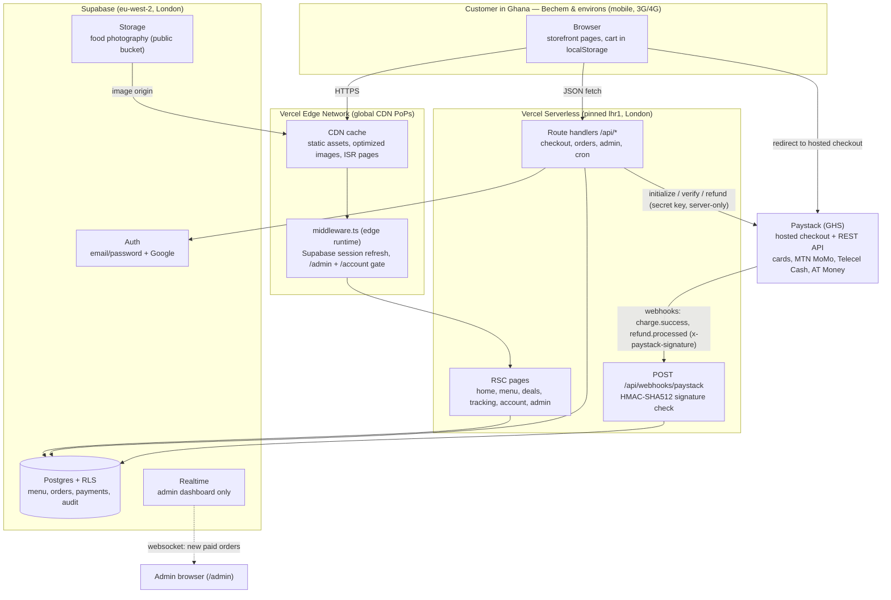
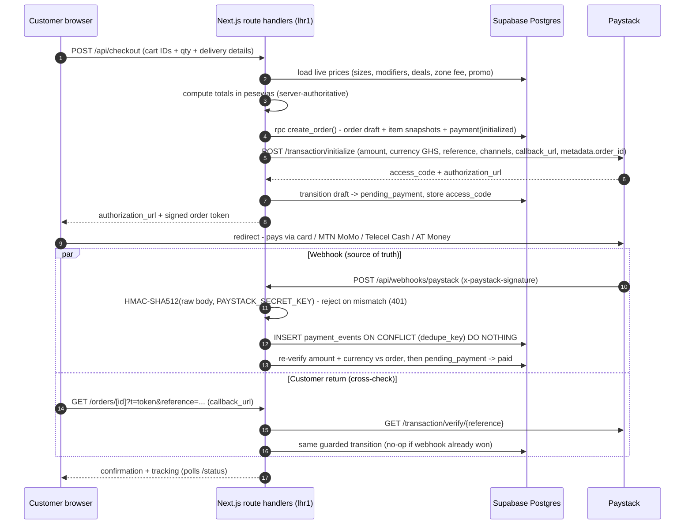

# Avalanche Pizza — Architecture Specification

**Status:** Draft v1.0 for owner approval (Stage 1 gate). **Owner:** Frank (product); engineering executes.
**Market:** Bechem, Ahafo Region, Ghana ("premium tasty pizza in the heart of Bechem"). **Hosting:** UK (Vercel `lhr1` + Supabase `eu-west-2`).

This document is the single source of truth for the launch build. Locked decisions ([ADRs](DECISIONS.md): Paystack, Next.js App Router on Vercel `lhr1`, Supabase London, guest checkout + optional accounts, Stitch-originated frontend, no microservices) are assumed and not re-litigated. All money is stored as **integer pesewas** (1 GHS = 100 pesewas). All validation at trust boundaries uses **zod**.

---

## 1. System Overview

A single Next.js 15 (App Router, TypeScript `strict`) application serves the storefront, the admin area, and all APIs. Vercel's global CDN serves static assets, images, and ISR-cached pages from PoPs close to West Africa; dynamic compute runs in serverless functions pinned to **London (`lhr1`)**, ~10 ms from Supabase (**eu-west-2**) and close to Paystack's infrastructure. Ghana → London RTT (~120–150 ms over the WACS/MainOne/ACE submarine routes) is paid once per dynamic request; everything cacheable is pushed to the CDN.

Payments never touch our servers: the customer is redirected to Paystack's hosted checkout (cards + MTN MoMo + Telecel Cash + AT Money, GHS), keeping us at **PCI SAQ-A**. Order fulfilment is driven by Paystack webhooks (source of truth) with a verify-API cross-check on customer return.



**Core principles**

1. **Server-authoritative pricing.** The client sends product/size/modifier/deal IDs and quantities; the server recomputes every amount from the database. Client-supplied prices are display hints only.
2. **Snapshot-on-order.** Orders capture names, prices, and modifier details at purchase time (Section 3.4). Menu edits never rewrite history.
3. **Idempotent money paths.** Webhook ledger with unique dedupe keys; state transitions expressed as conditional `UPDATE ... WHERE status = ANY(from)` so races (webhook vs. verify) resolve safely.
4. **One boring runtime.** All route handlers on the Node.js runtime in `lhr1`. Edge runtime only for `middleware.ts`. No queues, no workers, no extra services; Vercel Cron covers the single scheduled job.
5. **Bytes are money in Ghana.** Budgets for JS, images, and fonts are CI-enforced (Section 8).

**Third-party surface (complete list):** Vercel (hosting, CDN, image optimization, cron), Supabase (Postgres, Auth, Storage, Realtime), Paystack (payments), Cloudflare Turnstile (bot defence on checkout/signup), Sentry (errors), GitHub Actions (CI). Nothing else at launch.

---

## 2. Repository Structure

Single repo, single Next.js app. Package manager: **pnpm**. Node 22 LTS.

```
Avalanche-pizza-/
├── docs/
│   ├── ARCHITECTURE.md               # this document
│   ├── SECURITY.md                   # threat model, controls, compliance, launch gate
│   └── DECISIONS.md                  # locked ADRs
├── design/
│   └── stitch-exports/               # raw Stitch HTML/Tailwind exports (reference only, never imported)
├── public/
│   ├── manifest.webmanifest          # PWA-lite manifest (Section 8.5)
│   ├── icons/                        # app icons, favicon
│   └── og/                           # static OpenGraph images
├── src/
│   ├── app/
│   │   ├── layout.tsx                # root layout: fonts, theme, <CartProvider/>
│   │   ├── globals.css               # Tailwind v4 + design tokens extracted from Stitch (ADR-005)
│   │   ├── page.tsx                  # Home (ISR)
│   │   ├── menu/page.tsx             # Core Menu, single page, category anchors (ISR)
│   │   ├── deals/page.tsx            # Special Deals index (ISR)
│   │   ├── deals/[slug]/page.tsx     # Deal builder: The Ascent, The Gathering, ... (ISR shell + client builder)
│   │   ├── cart/page.tsx             # client-rendered cart (static shell)
│   │   ├── checkout/page.tsx         # dynamic (zones, promo)
│   │   ├── orders/[orderId]/page.tsx # confirmation + live tracking (dynamic, token-gated)
│   │   ├── track/page.tsx            # guest lookup: order number + phone
│   │   ├── (auth)/
│   │   │   ├── login/page.tsx        # Stitch Login design
│   │   │   └── auth/callback/route.ts# Supabase OAuth/PKCE code exchange
│   │   ├── account/
│   │   │   ├── page.tsx              # profile overview
│   │   │   ├── orders/page.tsx       # history + reorder
│   │   │   └── addresses/page.tsx
│   │   ├── admin/
│   │   │   ├── layout.tsx            # server-side role gate (defense in depth vs middleware)
│   │   │   ├── page.tsx              # live orders board (Supabase Realtime)
│   │   │   ├── orders/[orderId]/page.tsx
│   │   │   └── menu/page.tsx         # availability toggles (86 board)
│   │   └── api/
│   │       ├── checkout/route.ts             # POST: price + create order + Paystack init
│   │       ├── checkout/quote/route.ts       # POST: server-side cart pricing preview
│   │       ├── orders/lookup/route.ts        # POST: guest lookup (rate-limited)
│   │       ├── orders/[orderId]/route.ts     # GET: full order detail
│   │       ├── orders/[orderId]/status/route.ts  # GET: tiny polling payload
│   │       ├── orders/[orderId]/verify/route.ts  # POST: Paystack verify cross-check
│   │       ├── orders/[orderId]/pay/route.ts     # POST: new payment attempt (retry)
│   │       ├── orders/[orderId]/cancel/route.ts  # POST: pre-payment cancel
│   │       ├── account/claim-orders/route.ts     # POST: merge guest orders into account
│   │       ├── admin/orders/route.ts             # GET: filterable order list
│   │       ├── admin/orders/[orderId]/transition/route.ts  # POST: advance status
│   │       ├── admin/orders/[orderId]/refund/route.ts      # POST: initiate Paystack refund
│   │       ├── admin/menu/availability/route.ts  # PATCH: 86 items + revalidateTag
│   │       ├── webhooks/paystack/route.ts        # POST: signature-verified webhook sink
│   │       ├── cron/expire-orders/route.ts       # Vercel Cron: expire stale pending_payment
│   │       └── health/route.ts                   # GET: liveness + DB reachability
│   ├── components/
│   │   ├── ui/                       # primitives from the Stitch token set: Button, Card, Badge, Sheet, Input...
│   │   ├── storefront/               # ProductCard, DealCard, CartSheet, ModifierPicker, ZoneSelect...
│   │   ├── tracking/                 # OrderStatusTimeline, StatusPoller
│   │   └── admin/                    # OrdersBoard, StatusButton, RefundDialog
│   ├── lib/
│   │   ├── env.ts                    # zod-parsed env (server + client schemas), fail-fast at boot
│   │   ├── supabase/
│   │   │   ├── browser.ts            # createBrowserClient (anon key)
│   │   │   ├── server.ts             # createServerClient (cookies, RSC/route handlers)
│   │   │   └── admin.ts              # service-role client, 'server-only' import guard
│   │   ├── schemas/                  # zod: cartSchema, checkoutSchema, phoneGh, addressSchema...
│   │   ├── pricing/
│   │   │   ├── price-order.ts        # THE pricing engine (pure, unit-tested)
│   │   │   └── promo.ts              # promo validation + discount math
│   │   ├── orders/
│   │   │   ├── state-machine.ts      # transition table + transitionOrder()
│   │   │   └── order-number.ts       # Crockford base32 short codes (AV-7GK4Q)
│   │   ├── paystack/
│   │   │   ├── client.ts             # typed fetch wrapper: initialize, verify, refund
│   │   │   └── webhook.ts            # HMAC-SHA512 verification, event parsing (zod)
│   │   ├── tokens.ts                 # jose HS256 order-access tokens
│   │   ├── rate-limit.ts             # Postgres fixed-window limiter
│   │   ├── format.ts                 # formatPesewas() via Intl.NumberFormat('en-GH')
│   │   └── cart/
│   │       ├── store.ts              # zustand + persist (localStorage 'avalanche.cart.v1')
│   │       └── types.ts
│   ├── middleware.ts                 # edge: session refresh, /admin + /account gating
│   └── types/
│       └── database.ts               # supabase gen types typescript (generated, committed)
├── supabase/
│   ├── config.toml                   # supabase CLI local stack
│   ├── migrations/
│   │   ├── 00001_extensions_enums.sql
│   │   ├── 00002_menu.sql
│   │   ├── 00003_customers.sql
│   │   ├── 00004_orders_payments.sql
│   │   ├── 00005_rls.sql
│   │   └── 00006_functions.sql       # create_order, transition_order, process refund, rate_limit
│   └── seed.sql                      # zones, categories, products, sizes, modifiers, 5 signature deals
├── tests/
│   ├── integration/                  # route handlers vs local Supabase (Section 11)
│   ├── e2e/                          # Playwright smoke (Paystack network-mocked)
│   └── fixtures/                     # recorded Paystack payloads, cart fixtures
├── scripts/
│   ├── simulate-paystack-webhook.ts  # signs fixture with test secret, POSTs to local /api/webhooks/paystack
│   └── check-bundle-budget.mjs       # fails CI if first-load JS exceeds budget
├── .github/workflows/
│   ├── ci.yml                        # PR pipeline
│   └── deploy-production.yml         # migrate -> deploy (Section 10)
├── vercel.json                       # regions: ["lhr1"], crons
├── next.config.ts                    # images.remotePatterns (Supabase storage), headers
├── playwright.config.ts
├── vitest.config.ts                  # unit (colocated *.test.ts)
├── vitest.integration.config.ts
└── package.json
```

Unit tests are colocated (`src/**/*.test.ts`); integration and e2e live under `tests/`. No ORM: reads go through `supabase-js` with generated types; **all transactional writes go through Postgres functions (RPC)** defined in migrations, because `supabase-js` has no client-side transactions and a pooled `pg` connection is avoidable complexity.

---

## 3. Data Model

All tables in schema `public`, UUID PKs (`gen_random_uuid()`) unless noted, `created_at`/`updated_at timestamptz` (auto-touch trigger) everywhere. Money columns are `integer` pesewas with `CHECK (>= 0)`. Prices are **VAT/levy-inclusive** at launch (standard for Ghanaian food retail); a tax-breakdown column set is deferred.

**Enums** (migration `00001`):

```sql
create type order_status as enum ('draft','pending_payment','paid','preparing','out_for_delivery','delivered','cancelled','failed','refunded');
create type payment_status as enum ('initialized','pending','success','failed','abandoned','refund_pending','refunded');
create type item_type as enum ('product','deal');
create type discount_type as enum ('percent','fixed');
```

### 3.1 Menu catalog

**`menu_categories`** — Pizzas, Sides, Drinks, Desserts.

| column | type / constraint |
|---|---|
| id | uuid PK |
| slug | text UNIQUE NOT NULL |
| name | text NOT NULL |
| description | text |
| sort_order | int NOT NULL DEFAULT 0 |
| is_active | boolean NOT NULL DEFAULT true |

**`products`**

| column | type / constraint |
|---|---|
| id | uuid PK |
| category_id | uuid NOT NULL REFERENCES menu_categories |
| slug | text UNIQUE NOT NULL |
| name | text NOT NULL |
| description | text |
| image_path | text — Supabase Storage path in bucket `menu` |
| is_available | boolean NOT NULL DEFAULT true — the "86" switch, admin-togglable |
| is_active | boolean NOT NULL DEFAULT true — hard hide |
| tags | text[] DEFAULT '{}' — `spicy`, `veggie`, `new` |
| sort_order | int NOT NULL DEFAULT 0 |

Index: `(category_id, sort_order)`.

**`product_sizes`** — every product has at least one size row; single-price items get one `Regular` row. This keeps pricing uniform: **price always lives on the size, never on the product**.

| column | type / constraint |
|---|---|
| id | uuid PK |
| product_id | uuid NOT NULL REFERENCES products ON DELETE CASCADE |
| name | text NOT NULL — `Small` / `Medium` / `Large` / `Regular` |
| price_pesewas | int NOT NULL CHECK (price_pesewas >= 0) |
| is_default | boolean NOT NULL DEFAULT false |
| sort_order | int NOT NULL DEFAULT 0 |

Unique: `(product_id, name)`.

**`modifier_groups`** — e.g. "Extra Toppings" (multiple, 0–8), "Crust" (single, required).

| column | type / constraint |
|---|---|
| id | uuid PK |
| name | text NOT NULL |
| selection_type | text NOT NULL CHECK (in ('single','multiple')) |
| min_select | int NOT NULL DEFAULT 0 |
| max_select | int — NULL = unlimited |
| sort_order | int NOT NULL DEFAULT 0 |

**`modifiers`** (toppings)

| column | type / constraint |
|---|---|
| id | uuid PK |
| group_id | uuid NOT NULL REFERENCES modifier_groups ON DELETE CASCADE |
| name | text NOT NULL — `Extra Mozzarella`, `Beef`, `Thin Crust` |
| price_pesewas | int NOT NULL DEFAULT 0 |
| is_available | boolean NOT NULL DEFAULT true |
| sort_order | int NOT NULL DEFAULT 0 |

Index: `(group_id, sort_order)`.

**`product_modifier_groups`** — attaches groups to products. PK `(product_id, group_id)`, plus `sort_order`.

### 3.2 Deals

The five signature deals ("The Ascent", "The Gathering", "Party Feast", "All 4 One", "Free Choice") are all expressible as: **fixed price + N slots, each slot constrained by category and/or explicit product list and/or allowed sizes**.

**`deals`**

| column | type / constraint |
|---|---|
| id | uuid PK |
| slug | text UNIQUE NOT NULL — `the-ascent`, `party-feast`, ... |
| name | text NOT NULL |
| tagline | text |
| description | text |
| price_pesewas | int NOT NULL |
| image_path | text |
| is_active | boolean NOT NULL DEFAULT true |
| starts_at / ends_at | timestamptz — NULL = always on |
| sort_order | int NOT NULL DEFAULT 0 |

**`deal_slots`**

| column | type / constraint |
|---|---|
| id | uuid PK |
| deal_id | uuid NOT NULL REFERENCES deals ON DELETE CASCADE |
| name | text NOT NULL — `Choose your pizza`, `Pick 2 sides` |
| quantity | int NOT NULL DEFAULT 1 — picks required in this slot |
| allowed_category_id | uuid REFERENCES menu_categories — NULL = any |
| allowed_size_names | text[] — e.g. `{Large}`; NULL = any size |
| sort_order | int NOT NULL DEFAULT 0 |

**`deal_slot_products`** — optional explicit whitelist per slot. PK `(slot_id, product_id)`. If a slot has whitelist rows, only those products qualify; otherwise the category/size constraints apply. "Free Choice" = slots with `allowed_category_id = NULL`.

### 3.3 Customers

**`profiles`** — 1:1 with `auth.users`, created by trigger on signup.

| column | type / constraint |
|---|---|
| id | uuid PK REFERENCES auth.users ON DELETE CASCADE |
| full_name | text |
| phone | text — E.164 `+233XXXXXXXXX`; **unverified at launch** (display/prefill only) |
| role | text NOT NULL DEFAULT 'customer' CHECK (in ('customer','admin')) — mirror for admin UI; the **authoritative** role is the `app_metadata.role` JWT claim |
| default_address_id | uuid REFERENCES addresses (deferred FK) |

**`addresses`**

| column | type / constraint |
|---|---|
| id | uuid PK |
| user_id | uuid NOT NULL REFERENCES auth.users ON DELETE CASCADE |
| label | text — `Home`, `Office` |
| area | text NOT NULL — neighbourhood/suburb |
| address_line | text NOT NULL |
| landmark | text — critical in Ghana (directions-by-landmark culture) |
| delivery_zone_id | uuid REFERENCES delivery_zones |
| phone | text |
| is_default | boolean NOT NULL DEFAULT false |

Index: `(user_id)`.

**`delivery_zones`** — flat zone → fee model (locked). Seed with Bechem-centric zones — exact zone list, fees, and reach to be confirmed with the owner; working assumption: Bechem town core plus surrounding communities within delivery range (e.g. Derma, Techimantia, Duayaw Nkwanta) as the business decides.

| column | type / constraint |
|---|---|
| id | uuid PK |
| name | text UNIQUE NOT NULL |
| fee_pesewas | int NOT NULL |
| min_order_pesewas | int NOT NULL DEFAULT 0 |
| eta_min_minutes / eta_max_minutes | int — shown on tracking page |
| is_active | boolean NOT NULL DEFAULT true |
| sort_order | int NOT NULL DEFAULT 0 |

### 3.4 Orders — the snapshot-on-order pattern

An order must remain a truthful receipt forever, even after the menu changes. Therefore:

- `order_items` copies **`name_snapshot`, `size_name_snapshot`, `unit_price_pesewas`, and full modifier details** (`modifiers_snapshot` jsonb) at purchase time. The `product_id`/`deal_id` FKs are kept for analytics but declared `ON DELETE SET NULL` — deleting a menu item never corrupts an order.
- `orders` copies the zone name and fee, the promo code text, and the full delivery address as plain columns (guest addresses have no `addresses` row at all).
- A **deal purchase is a single `order_items` row** (`item_type='deal'`, `unit_price_pesewas` = deal price) whose `components_snapshot` jsonb records the chosen products/sizes/modifiers per slot. This renders cleanly on receipts and avoids ambiguous per-component pricing.
- Totals carry a database `CHECK` so a receipt can never disagree with itself.

**`orders`**

| column | type / constraint |
|---|---|
| id | uuid PK |
| order_number | text UNIQUE NOT NULL — human short code `AV-7GK4Q` (Crockford base32, no `I/L/O/U`) |
| user_id | uuid REFERENCES auth.users ON DELETE SET NULL — NULL for guests |
| customer_name | text NOT NULL |
| phone | text NOT NULL — normalized E.164 `+233...` |
| email | text |
| status | order_status NOT NULL DEFAULT 'draft' |
| subtotal_pesewas | int NOT NULL |
| delivery_fee_pesewas | int NOT NULL |
| discount_pesewas | int NOT NULL DEFAULT 0 |
| total_pesewas | int NOT NULL, `CHECK (total_pesewas = subtotal_pesewas + delivery_fee_pesewas - discount_pesewas)` |
| currency | char(3) NOT NULL DEFAULT 'GHS' CHECK (currency = 'GHS') |
| delivery_zone_id | uuid REFERENCES delivery_zones ON DELETE RESTRICT |
| zone_name_snapshot | text NOT NULL |
| area / address_line / landmark / delivery_notes | text (address_line NOT NULL) |
| promo_code_id | uuid REFERENCES promo_codes ON DELETE SET NULL |
| promo_code_snapshot | text |
| needs_review | boolean NOT NULL DEFAULT false — set on amount/currency mismatch, never auto-fulfilled |
| placed_at / paid_at / delivered_at / cancelled_at | timestamptz |

Indexes: `UNIQUE(order_number)`, `(user_id, created_at DESC)`, `(phone)`, `(status, created_at DESC)` — the admin board query.

**`order_items`**

| column | type / constraint |
|---|---|
| id | uuid PK |
| order_id | uuid NOT NULL REFERENCES orders ON DELETE CASCADE |
| item_type | item_type NOT NULL |
| product_id | uuid REFERENCES products ON DELETE SET NULL |
| product_size_id | uuid REFERENCES product_sizes ON DELETE SET NULL |
| deal_id | uuid REFERENCES deals ON DELETE SET NULL |
| name_snapshot | text NOT NULL |
| size_name_snapshot | text |
| unit_price_pesewas | int NOT NULL |
| quantity | int NOT NULL CHECK (quantity BETWEEN 1 AND 50) |
| modifiers_snapshot | jsonb NOT NULL DEFAULT '[]' — `[{modifier_id, group_name, name, price_pesewas}]` |
| components_snapshot | jsonb — deals only: `[{slot_name, product_name, size_name, modifiers:[...]}]` |
| line_total_pesewas | int NOT NULL — `(unit + Σ modifier prices) × quantity`, recomputed and asserted server-side |

Index: `(order_id)`.

### 3.5 Payments & webhook ledger

**`payments`** — one row per payment **attempt**; retries create new rows (Paystack references are single-use).

| column | type / constraint |
|---|---|
| id | uuid PK |
| order_id | uuid NOT NULL REFERENCES orders |
| provider | text NOT NULL DEFAULT 'paystack' |
| reference | text UNIQUE NOT NULL — we generate: `{order_number}-{attempt_n}`, e.g. `AV-7GK4Q-1` |
| access_code | text — from initialize |
| authorization_url | text |
| amount_pesewas | int NOT NULL — must equal `orders.total_pesewas` at init |
| currency | char(3) NOT NULL DEFAULT 'GHS' |
| channel | text — `card`, `mobile_money` (set from webhook/verify) |
| status | payment_status NOT NULL DEFAULT 'initialized' |
| paystack_transaction_id | bigint UNIQUE |
| fees_pesewas | int — Paystack fee from verify payload (reporting) |
| paid_at | timestamptz |

Indexes: `UNIQUE(reference)`, `(order_id, created_at DESC)`.

**`payment_events`** — the idempotency ledger. Every webhook delivery is inserted here **before** any processing.

| column | type / constraint |
|---|---|
| id | uuid PK |
| provider | text NOT NULL DEFAULT 'paystack' |
| event_type | text NOT NULL — `charge.success`, `refund.processed`, ... |
| reference | text |
| paystack_transaction_id | bigint |
| dedupe_key | text **UNIQUE NOT NULL** — `{event_type}:{paystack_transaction_id ?? reference}` |
| signature_valid | boolean NOT NULL |
| raw_body | jsonb NOT NULL — full payload for audit/replay |
| status | text NOT NULL CHECK (in ('received','processed','duplicate','ignored','error')) |
| error | text |
| received_at / processed_at | timestamptz |

Idempotency: `INSERT ... ON CONFLICT (dedupe_key) DO NOTHING`; zero rows inserted → duplicate → return 200 immediately.

### 3.6 Promotions & audit

**`promo_codes`**

| column | type / constraint |
|---|---|
| id | uuid PK |
| code | text UNIQUE NOT NULL — stored uppercase |
| description | text |
| discount_type | discount_type NOT NULL |
| discount_value | int NOT NULL — percent (1–100) or pesewas |
| min_subtotal_pesewas | int NOT NULL DEFAULT 0 |
| max_discount_pesewas | int — cap for percent codes |
| starts_at / ends_at | timestamptz |
| max_redemptions | int — NULL = unlimited |
| per_customer_limit | int NOT NULL DEFAULT 1 — keyed on phone for guests, user_id for accounts |
| is_active | boolean NOT NULL DEFAULT true |

Discounts apply to the **subtotal only** (never the delivery fee), floored at zero.

**`promo_redemptions`** — `id`, `promo_code_id` FK, `order_id` FK UNIQUE, `user_id` (nullable), `phone`, `redeemed_at`. A redemption is recorded when the order reaches `paid` (inside the same transaction), not at checkout — abandoned checkouts don't burn codes.

**`audit_log`** — append-only.

| column | type / constraint |
|---|---|
| id | bigint GENERATED ALWAYS AS IDENTITY PK |
| actor_type | text NOT NULL CHECK (in ('customer','guest','admin','system','webhook')) |
| actor_id | text — user UUID, or `paystack`, or `cron` |
| action | text NOT NULL — `order.transition.paid`, `order.refund.initiated`, `menu.availability.toggle`, ... |
| entity_type / entity_id | text NOT NULL |
| before / after | jsonb |
| meta | jsonb — ip, user agent, reference |
| created_at | timestamptz DEFAULT now() |

Index: `(entity_type, entity_id, created_at DESC)`. RLS: no client access whatsoever; admin reads go through server routes.

**`rate_limits`** — `key text`, `window_start timestamptz`, `count int`, PK `(key, window_start)`. Backs `check_rate_limit(key, max, window_seconds)` — a boring Postgres fixed-window limiter (no Redis at launch).

### 3.7 RLS matrix

`anon` and `authenticated` roles get **read-only** access to catalog data; **all writes and all order/payment access flow through server route handlers using the service-role client**. RLS is defense-in-depth plus the enabler for account pages and admin Realtime.

| Table(s) | anon | authenticated | admin (JWT `app_metadata.role='admin'`) | service role |
|---|---|---|---|---|
| menu_categories, products, product_sizes, modifier_groups, modifiers, product_modifier_groups, deals, deal_slots, deal_slot_products, delivery_zones | SELECT where active | same | same | all |
| profiles | — | SELECT/UPDATE own row | SELECT all | all |
| addresses | — | CRUD own rows | — | all |
| orders, order_items | — | SELECT own (`user_id = auth.uid()`; items via order join) | SELECT all (enables Realtime subscription) | all |
| payments, payment_events, promo_codes, promo_redemptions, audit_log, rate_limits | — | — | — | all |

Guests never query orders through RLS — guest access is mediated by signed order tokens verified in route handlers (Section 6).

### 3.8 Transactional Postgres functions (migration `00006`)

- `create_order(payload jsonb) returns orders` — inserts order + items + first payment row atomically; generates `order_number` with retry-on-collision.
- `transition_order(p_order_id uuid, p_from order_status[], p_to order_status, p_actor_type text, p_actor_id text, p_meta jsonb) returns orders` — `UPDATE orders SET status = p_to, ... WHERE id = p_order_id AND status = ANY(p_from) RETURNING *`; raises if zero rows (illegal transition); writes `audit_log`; sets `paid_at`/`cancelled_at`/`delivered_at` as appropriate; records promo redemption on `→ paid`.
- `check_rate_limit(p_key text, p_max int, p_window_seconds int) returns boolean`.

All are `security definer`, callable only by the service role (revoke from `anon`/`authenticated`).

---

## 4. API Surface

Route handlers are the primary API (testable as plain functions); server actions are used only for trivial authed form mutations (e.g., set default address). Every handler validates input with zod and returns typed JSON errors `{error: {code, message}}`.

| Route | Method | Auth level | Purpose |
|---|---|---|---|
| `/api/checkout/quote` | POST | public | Price a cart server-side: item lines, subtotal, zone fee, promo validation, total. Used by cart + checkout pages so stale localStorage prices self-heal. Creates nothing. |
| `/api/checkout` | POST | public (attaches `user_id` if session exists) | Validate cart + delivery details → recompute totals from DB → `create_order()` → Paystack initialize → order `draft → pending_payment`. Returns `{order_id, order_number, authorization_url, order_token}`. Rate limit: 10/hr per phone+IP. |
| `/api/orders/lookup` | POST | public, rate-limited (5 / 15 min / IP) | Guest re-entry: `{order_number, phone}` → both must match → returns fresh order token + tracking URL. |
| `/api/orders/[orderId]` | GET | guest-token **or** owner **or** admin | Full order detail (items, snapshots, status, payment state) for confirmation/tracking page. |
| `/api/orders/[orderId]/status` | GET | guest-token or owner | Tiny polling payload: `{status, updated_at, eta_min, eta_max}` (< 1 KB). |
| `/api/orders/[orderId]/verify` | POST | guest-token or owner | Customer-return cross-check: calls Paystack verify API, applies idempotent transition (Section 5.4). |
| `/api/orders/[orderId]/pay` | POST | guest-token or owner | Retry after `failed`/abandoned: new `payments` row, new reference, fresh `authorization_url`; re-prices nothing (order totals are frozen). |
| `/api/orders/[orderId]/cancel` | POST | guest-token or owner | Allowed only in `draft`/`pending_payment`. |
| `/api/account/claim-orders` | POST | authenticated | Merge guest orders into the account (Section 6.3). Body: `{tokens: string[]}`. |
| `/api/admin/orders` | GET | admin | Filterable list (status, date range, search by order_number/phone) for the board. |
| `/api/admin/orders/[orderId]/transition` | POST | admin | `{to}` — enforced by `transition_order()`; triggers no other side effects at launch. |
| `/api/admin/orders/[orderId]/refund` | POST | admin | Calls Paystack `POST /refund` (full amount at launch) → payment `refund_pending`; final state lands via `refund.processed` webhook. |
| `/api/admin/menu/availability` | PATCH | admin | `{product_id \| deal_id \| modifier_id, is_available}` → update + `revalidateTag('menu')` / `('deals')` + audit. |
| `/api/webhooks/paystack` | POST | **service-only** — HMAC-SHA512 signature is the sole authentication | Webhook sink (Section 5.3). |
| `/api/cron/expire-orders` | POST | service-only — `Authorization: Bearer ${CRON_SECRET}` (Vercel Cron) | Every 15 min: for `pending_payment` orders older than 45 min, run verify sweep on their latest reference; success → `paid` (late MoMo confirmations happen), else → `failed` + payment `abandoned`. |
| `/api/health` | GET | public | `{ok, db: ok}` — cheap Supabase ping. |
| `/auth/callback` | GET | public | Supabase PKCE code exchange (email confirm + Google OAuth). |

**Auth levels defined:** `public` (no credentials), `guest-token` (valid signed order token for that specific order), `authenticated` (Supabase session), `admin` (session + `app_metadata.role='admin'` claim, re-checked server-side in every admin handler — never trust middleware alone), `service-only` (webhook signature or cron secret; no human path).

---

## 5. Payment Flow (Paystack, GHS)

Paystack amounts are denominated in the smallest currency subunit — for GHS that is **pesewas**, which is exactly our storage unit. Integers pass end-to-end; **no float arithmetic exists anywhere in the money path.**

**Checkout mode (decided):** Paystack **hosted redirect checkout** (`authorization_url`) at launch, not Inline JS. Rationale: zero third-party JS on our pages (CSP stays tight, ~30 KB saved on 3G), Paystack's hosted page handles the MoMo prompt/OTP dance (STK push + USSD fallback) more reliably than an embedded popup on low-end Android, and PCI SAQ-A is trivially satisfied. Inline can be revisited post-launch; the server contract does not change.



### 5.1 Server-side initialization — the amount is never trusted from the client

`POST /api/checkout` receives only **IDs and quantities**. The pricing engine (`src/lib/pricing/price-order.ts`, pure and unit-tested) loads current rows and computes:

```
line_total  = (size.price_pesewas + Σ modifier.price_pesewas) × quantity     (products)
line_total  = deal.price_pesewas × quantity                                   (deals; components priced at 0)
subtotal    = Σ line_total
discount    = promo(subtotal)          -- percent capped by max_discount, or fixed; never exceeds subtotal
total       = subtotal + zone.fee_pesewas − discount
```

Validation failures are hard 422s: unavailable/inactive item, modifier not attached to product, deal slot constraint violated (wrong category/size/count), zone inactive, `subtotal < zone.min_order_pesewas`, promo invalid/exhausted. If the client's *displayed* total (sent as `expected_total_pesewas`) differs from the server total, return **409 with the fresh quote** so the UI re-renders — this converts stale-price bugs into a benign "prices updated" flow instead of a dispute.

Then, in order: `create_order()` (atomic), Paystack `POST https://api.paystack.co/transaction/initialize` with `{email (or synthesized guest alias 'orders+{order_number}@<final-domain-TBC>' when absent — Paystack requires an email), amount: total_pesewas, currency: 'GHS', reference: 'AV-7GK4Q-1', channels: ['card','mobile_money'], callback_url: '{SITE_URL}/orders/{id}?t={token}', metadata: {order_id, order_number}}`. On initialize failure the order stays `draft` and the client may retry (same order, attempt 2). On success: `draft → pending_payment`, `placed_at` set.

### 5.2 Order state machine

| From | To | Trigger | Actor |
|---|---|---|---|
| draft | pending_payment | Paystack initialize succeeded | system |
| draft | cancelled | abandoned pre-init, explicit cancel | customer/guest, admin |
| pending_payment | paid | `charge.success` webhook **or** verify cross-check, after amount+currency re-verification | system only |
| pending_payment | failed | verify shows failed/abandoned; cron expiry at 45 min | system (cron/verify) |
| pending_payment | cancelled | customer cancels before paying | customer/guest, admin |
| failed | pending_payment | customer retries payment (`/pay`, new reference) | customer/guest |
| paid | preparing | kitchen accepts | admin |
| preparing | out_for_delivery | rider dispatched | admin |
| out_for_delivery | delivered | handed over | admin |
| paid, preparing | cancelled | shop cannot fulfil (stock, closing) — refund follows | admin |
| paid, preparing, out_for_delivery, delivered, cancelled(post-payment) | refunded | `refund.processed` webhook after admin-initiated refund | system (webhook), initiated by admin |

Terminal: `delivered`, `refunded`, `cancelled` (pre-payment), `failed` (retryable). Every transition goes through `transition_order()` — there is exactly one code path that changes `orders.status`, and it always writes `audit_log`. Customers can **never** trigger `paid` or any kitchen state; admins can **never** trigger `paid` (money states belong to the system; a manual override would use a service-role script with an audit entry, not the UI).

### 5.3 Webhook handling — `POST /api/webhooks/paystack`

1. **Raw body first.** `const raw = await req.text()` before any JSON parsing (Next.js route handlers give us the untouched body; no middleware may consume it).
2. **Signature.** `crypto.createHmac('sha512', env.PAYSTACK_SECRET_KEY).update(raw).digest('hex')` compared with `x-paystack-signature` using `crypto.timingSafeEqual`. Paystack signs with your **secret key** (there is no separate webhook secret). Mismatch → 401, log, no ledger row.
3. **Ledger insert.** Parse with zod, build `dedupe_key`, `INSERT ... ON CONFLICT DO NOTHING`. Conflict → respond `200 {"status":"duplicate"}` — Paystack retries unacknowledged events for days; duplicates are normal.
4. **Dispatch by `event_type`:**
   - `charge.success`: load `payments` by `data.reference`. **Re-verify `data.amount === orders.total_pesewas AND data.currency === 'GHS'`** against our DB — if mismatched, set `orders.needs_review = true`, ledger `status='error'`, audit, alert (Sentry), **do not fulfil**, still return 200. If clean: payment → `success` (store `paystack_transaction_id`, `channel`, `fees_pesewas`, `paid_at`), then `transition_order(pending_payment → paid)`. If the order is already `paid` (verify path won), this is a recorded no-op.
   - `refund.processed`: payment → `refunded`, `transition_order(→ refunded)`.
   - `refund.failed`: payment back to `success`, `needs_review = true`, alert.
   - Anything else: ledger `status='ignored'`, 200.
5. **Always 200 fast** (< 5 s) once the ledger row exists; processing errors are recorded on the ledger row for replay via the simulate script. Note: Paystack does **not** emit a failure webhook for ordinary abandoned checkouts — that is exactly why the verify-on-return path and the cron sweep exist.

### 5.4 Verify on customer return

The callback lands the customer on `/orders/[id]?t=...&reference=...`. That page (or its `POST /verify` call) hits `GET https://api.paystack.co/transaction/verify/{reference}` server-side and applies the **same** checks and the **same** guarded transition as the webhook. Webhook and verify race freely: the conditional `UPDATE ... WHERE status='pending_payment'` makes the second arrival a no-op. If verify reports `failed`/`abandoned`, the page offers "Try again" (`/pay`). If Paystack is unreachable, the page shows `pending_payment` and keeps polling — the webhook will settle it.

### 5.5 Refunds

Admin-initiated only, full-amount at launch: `POST /api/admin/orders/[id]/refund` → Paystack `POST /refund {transaction: paystack_transaction_id}` → payment `refund_pending` → `refund.processed` webhook completes the state machine. Cash never moves except through Paystack. Partial refunds: post-launch.

---

## 6. Guest Checkout Mechanics

### 6.1 Order access token

On order creation the server mints a **signed order token** (jose, HS256 with `ORDER_TOKEN_SECRET`): claims `{sub: order_id, scope: 'order:read', exp: now + 72h}`. It is embedded in the confirmation/tracking URL (`/orders/{id}?t=...`) and stored client-side. Possession of the token grants read access to **that one order** and the guest actions (`verify`, `pay`, `cancel` pre-payment). It is not stored in the DB (stateless verification); 72 h comfortably covers the delivery lifecycle, and expiry is recoverable via lookup.

### 6.2 Phone lookup (`/track`)

Guest enters `order_number` + `phone`. Server normalizes the phone to E.164, requires **both** to match, rate-limits 5 attempts / 15 min / IP (`check_rate_limit`), and on success issues a fresh token and redirects to the tracking page. Failures return a uniform "not found" (no oracle for which field was wrong). Order numbers are unguessable enough (32^5 space) that number+phone together is adequate for order-status data at launch.

### 6.3 Merging guest orders into an account

The browser keeps `[{order_id, order_number, token}]` in `localStorage` (`avalanche.orders.v1`). After signup/login, the client calls `POST /api/account/claim-orders {tokens}`; the server verifies each token signature (expired tokens still count for claiming — signature validity is sufficient proof of provenance) and sets `user_id` on orders where `user_id IS NULL`, with an audit entry per claim.

**Deliberately excluded at launch:** auto-merge by matching phone or email. Checkout phone/email are unverified, so matching would let anyone harvest a stranger's order history (names, addresses) by registering with their phone number. Phone-OTP-verified merge ("we found 3 past orders for +233…, verify to attach them") ships in the post-launch phase alongside an SMS provider (Hubtel or mNotify). The data model already supports it (`orders.phone` is indexed).

---

## 7. Rendering & Caching Strategy

All pages and handlers run on the **Node.js runtime in `lhr1`**; the only edge code is `middleware.ts` (Supabase session cookie refresh + `/admin`, `/account` gating). One runtime keeps Supabase/Paystack SDK behavior uniform and debugging boring.

| Page | Strategy | Details |
|---|---|---|
| `/` Home | **ISR**, `revalidate = 3600`, tags `menu`,`deals` | Fully cacheable at CDN; hero + featured deals. Streams RSC. |
| `/menu` | **ISR**, `revalidate = 300`, tag `menu` | Single page, category anchor sections (fewer round trips on 3G than per-category routes). Admin 86-toggle calls `revalidateTag('menu')` for instant updates. Category sections stream via Suspense. |
| `/deals`, `/deals/[slug]` | **ISR**, `revalidate = 300`, tag `deals` | Static shell + client-side deal-slot builder (choices validated server-side at checkout anyway). |
| `/cart` | Static shell + **client-rendered** | Cart lives in zustand + localStorage; on view, `POST /api/checkout/quote` refreshes authoritative prices. No server state. |
| `/checkout` | **Dynamic** (`force-dynamic`) | Needs live zones/promo; Suspense around zone list. Prefetched from `/cart` to hide latency. |
| `/orders/[orderId]` | **Dynamic** | Token/session gated. Confirmation + tracking in one page across the whole lifecycle. |
| `/track` | Static form + dynamic POST | |
| `/login`, `/account/*` | Dynamic | Session-dependent; low traffic. |
| `/admin/*` | Dynamic + **Supabase Realtime** | See below. |

**Order status updates — decision: polling for customers, Realtime for admin.**
Customer tracking polls `GET /api/orders/[id]/status` with SWR: `refreshInterval` 15 s while non-terminal, paused when `document.hidden`, stopped at terminal states. Rationale: the payload is < 1 KB; polling works through carrier NATs, proxies, and data-saver modes where websockets are flaky; it needs zero extra client JS (Supabase Realtime would pull the realtime client into the storefront bundle); and guest auth for Realtime channels (no Supabase session) is exactly the kind of clever we avoid. At pizza-shop order volumes, 15 s polling costs nothing.
The **admin board** is the opposite case — authenticated, one or two long-lived desktop/tablet sessions, freshness genuinely matters — so it subscribes to `postgres_changes` on `orders` (admin RLS SELECT makes this work) with a 10 s polling fallback if the socket drops.

---

## 8. Ghana Performance Strategy

Design constraint: mid-range Android, variable 3G/4G, **per-MB data cost**. Budgets are enforced in CI (Section 10), not aspirational.

### 8.1 Page-weight budgets (compressed, first visit)

| Page | Total transfer | First-load JS (gzip) | LCP target (4G, Ghana) |
|---|---|---|---|
| Home | ≤ 350 KB | ≤ 170 KB | ≤ 2.5 s |
| Menu | ≤ 400 KB (images lazy below fold) | ≤ 170 KB | ≤ 2.5 s |
| Checkout | ≤ 250 KB | ≤ 180 KB | ≤ 2.0 s |
| Repeat visit (any) | ≤ 60 KB | cached | ≤ 1.5 s |

### 8.2 Image pipeline

- **Origin:** Supabase Storage public bucket `menu` (master JPEGs, 1600 px longest edge). **Delivery:** `next/image` through Vercel Image Optimization (`images.remotePatterns` allowlists the Supabase host) — automatic AVIF→WebP→JPEG negotiation, CDN-cached, `Cache-Control: immutable`.
- **Size budgets:** hero food photography ≤ 110 KB (AVIF, 1080 w, `quality={65}` — dark moody photography compresses beautifully in AVIF); product cards ≤ 35 KB at 480 w; deal cards ≤ 50 KB; thumbnails ≤ 15 KB.
- Explicit `sizes` on every image (`(max-width: 768px) 50vw, 300px` for cards); `priority` on exactly one image per page (the LCP hero); everything else lazy. Tiny base64 `blurDataURL` placeholders (generated at seed time, stored alongside `image_path`) for perceived speed. `deviceSizes` capped at 1080, `qualities: [45, 65]` — DPR-3 phones get DPR-2 assets; nobody can see the difference on food photos and it halves bytes.
- Glows, gradients, and dividers are **CSS** (`box-shadow`, `text-shadow`), never image assets; no hero video, no Lottie.
- **All Stitch imagery is migrated:** the design exports reference temporary Google-CDN URLs; every image is downloaded, optimized, and re-homed to Supabase Storage during Stage 3.

### 8.3 Fonts

Via `next/font/google` (self-hosted at build, `latin` subset only, `display: swap`, zero layout-shift via size-adjust). Families follow the canonical Stitch token set (ADR-005/ADR-006 — the ember theme of the coded pages, confirmed by Frank 2026-08-10):

- **Metrophobic** — display/headings (single 400 weight, ~15 KB woff2); the exports lean on letter-spacing, not weight, for hierarchy.
- **Manrope variable** — body/UI, ~40 KB woff2, with `font-variant-numeric: tabular-nums` for prices.
- **JetBrains Mono 500** — the `label-caps` voice (badges, price tags, status labels); single static subset ~15 KB. If budget pressure appears, this is the first cut — labels fall back to Manrope with tracking.
- Only the body font is preloaded; total font transfer ≤ 85 KB. (If Frank instead chooses the "Neon Tokyo" direction — Sora/Inter/Space Grotesk — the same budget applies: two variable families plus at most one single-weight accent subset.)

### 8.4 JS discipline

- First-load JS ≤ 170 KB gzip on storefront routes, enforced by `scripts/check-bundle-budget.mjs` reading the build manifest in CI.
- Dependency policy: zustand (~3 KB), swr (~5 KB), zod, jose — no moment/dayjs (use `Intl`), no lodash, no charting, no Paystack Inline JS (redirect flow), no Supabase Realtime client in storefront chunks (admin-only dynamic import).
- Menu and deals pages are RSC-first: interactivity (modifier picker, cart sheet) isolated in small client islands. `next/dynamic` for the deal builder and anything below the fold.
- **Graceful degradation:** menu, deals, home, and tracking render meaningful HTML without JS (tracking falls back to full-page refresh via `<meta http-equiv="refresh" content="30">` inside a `<noscript>`). Cart/checkout require JS — acceptable. All mutating fetches have 15 s timeouts with visible retry affordances; checkout submit is idempotent client-side (button disables, order draft is reused on retry). Respect `Save-Data: on` header → serve `quality=45` images.

### 8.5 PWA — decision: manifest now, service worker later

At launch: `manifest.webmanifest` + icons + theme color (`#131313`), so Android offers "Add to Home Screen" — near-zero cost, real brand value. **No service worker at launch**: offline pizza ordering is not a coherent feature, SW cache-invalidation bugs during the rapid post-launch iteration window are a real hazard, and HTTP caching + ISR already deliver the repeat-visit wins. Revisit in the post-launch phase with Serwist (menu shell + offline "you're offline" page) once the menu schema is stable.

---

## 9. Environments & Configuration

| | local | preview (per-PR) | production |
|---|---|---|---|
| App | `next dev` | Vercel preview deploy (Git integration) | Vercel prod, **`regions: ["lhr1"]`** |
| Database | Supabase CLI local stack (Docker) | shared **staging** Supabase project (eu-west-2) | production Supabase project (eu-west-2), Pro plan, PITR |
| Paystack | test keys + simulate script | test keys (hosted checkout in test mode, test cards/MoMo) | live keys |
| Data | `supabase/seed.sql` | seeded staging data | real menu |

Region pinning (`vercel.json`):

```json
{
  "regions": ["lhr1"],
  "crons": [{ "path": "/api/cron/expire-orders", "schedule": "*/15 * * * *" }]
}
```

(15-minute cron requires **Vercel Pro** — required anyway for team seats and function limits.) `export const maxDuration = 30` on `/api/checkout` and `/api/webhooks/paystack`.

**Environment variables** — parsed by `src/lib/env.ts` (zod; server schema imports `server-only`, build fails on missing/malformed values):

| Variable | `NEXT_PUBLIC_`? | Secret | Purpose / notes |
|---|---|---|---|
| `NEXT_PUBLIC_SITE_URL` | yes | no | Canonical origin, used for Paystack `callback_url` |
| `NEXT_PUBLIC_SUPABASE_URL` | yes | no | Supabase project URL |
| `NEXT_PUBLIC_SUPABASE_ANON_KEY` | yes | no (publishable) | Browser client; RLS-bound |
| `SUPABASE_SERVICE_ROLE_KEY` | no | **yes** | Server-only Supabase client; bypasses RLS. Never in client bundles — guarded by `server-only` import |
| `SUPABASE_DB_URL` | no | **yes** | CI/migrations only (`supabase db push`); not read by the app |
| `PAYSTACK_SECRET_KEY` | no | **yes** | Initialize/verify/refund **and** webhook HMAC key (`sk_test_...` / `sk_live_...`) |
| `PAYSTACK_PUBLIC_KEY` | no (until Inline) | no | Stored for future Inline checkout; unused client-side at launch |
| `ORDER_TOKEN_SECRET` | no | **yes** | ≥ 32 random bytes; signs guest order tokens (jose HS256) |
| `CRON_SECRET` | no | **yes** | Bearer auth for `/api/cron/*` (Vercel sets header automatically) |
| `SENTRY_DSN` / `NEXT_PUBLIC_SENTRY_DSN` | mixed | no | Error reporting (server / client) |
| `SENTRY_AUTH_TOKEN` | no | **yes** | CI source-map upload only |

Rules: secrets live only in Vercel encrypted env + GitHub Actions secrets; `.env.example` lists every name with placeholders; preview and production use **different Supabase projects and different Paystack key modes** — no shared secrets across environments; key rotation is a documented two-minute operation (all secrets are single-purpose).

---

## 10. CI/CD

GitHub Actions + Vercel Git integration. Previews are automatic; **production deploys are owned by the pipeline** so migrations always land before code.

**`ci.yml` (every PR + main):**

1. `pnpm install --frozen-lockfile` (cached)
2. **typecheck** — `tsc --noEmit` (strict)
3. **lint** — ESLint 9 flat config + Prettier check
4. **unit** — `vitest run` (pricing engine, promo math, state machine, token utils, zod schemas)
5. **integration** — `supabase start` (Docker service) → apply migrations + seed → `vitest run -c vitest.integration.config.ts` (route handlers as functions against real Postgres: RLS matrix, webhook idempotency, checkout pricing, transitions)
6. **build** — `next build` (fails on type/route errors) → `node scripts/check-bundle-budget.mjs` (hard-fails > 170 KB first-load on storefront routes)
7. **e2e smoke** — Playwright against `next start` + local Supabase, Paystack mocked via `page.route()` (Section 11)
8. Vercel builds the preview deploy in parallel (pointed at staging Supabase + Paystack test keys)

**`deploy-production.yml` (push to `main`):**

1. Re-run gates 2–6 (fast, cached)
2. **Migrate:** `supabase db push` against production (`SUPABASE_DB_URL`) — migrations must be backwards-compatible with the currently deployed code (expand→migrate→contract discipline; enforced in review)
3. **Deploy:** `vercel pull && vercel build && vercel deploy --prebuilt --prod`
4. **Post-deploy check:** curl `/api/health` + one ISR page; failure alerts and the runbook says: revert commit → pipeline redeploys (roll-forward model; contract-phase migrations are never bundled with the same PR as the code that stops using them)

**Production gates (all required):** typecheck, lint, unit, integration (including the payment/webhook suite), build + bundle budget, e2e smoke, and a green migration step. Branch protection on `main`: PR + required checks; no direct pushes.

---

## 11. Testing Strategy

| Layer | Tool | Scope (what actually gets tested) |
|---|---|---|
| Unit | **Vitest** | `price-order.ts` exhaustively: sizes, modifier stacking, deal slot validation (category/size/quantity), promo percent/fixed/caps/min-subtotal, zone fees, min-order, rounding-free integer math. `state-machine.ts`: every legal and illegal transition. `tokens.ts`: expiry, tamper. Phone normalization (`0244... → +233244...`). Zod schemas: fuzz malformed carts. |
| Integration | **Vitest + Supabase CLI local stack** | Route handlers imported directly and invoked with `Request` objects against real Postgres. Key suites: (a) **RLS matrix** — anon/authed/admin JWTs assert Section 3.7 row-by-row; (b) **checkout** — cart in → correct order/items/payment rows, snapshots populated, 409 on stale totals, 422 on unavailable items; (c) **webhook** — signed `charge.success` transitions the order; the *same event twice* produces one ledger row and one transition; wrong signature → 401 + no ledger; **amount mismatch → `needs_review`, no fulfilment**; (d) verify/webhook race — both paths fired, exactly one `paid` audit entry; (e) claim-orders and lookup rate-limiting. |
| E2E | **Playwright** (Chromium mobile viewport 375×812, "Slow 4G" throttling on the smoke run) | Browse menu → configure pizza with modifiers → add deal ("The Gathering") → cart → checkout form (guest) → assert redirect URL is the mocked `authorization_url` → simulate return + status flip → tracking page shows `paid`. Admin: login → board shows order → advance to `preparing`. Login/account happy path. |
| Paystack | test keys + fixtures | **No live Paystack in CI.** e2e intercepts `api.paystack.co` with `page.route()`; integration tests hit handler code with recorded fixture payloads from `tests/fixtures/paystack/` signed by the test secret. **Local webhook simulation:** `pnpm tsx scripts/simulate-paystack-webhook.ts charge.success --reference AV-7GK4Q-1` computes the real HMAC-SHA512 and POSTs to `localhost:3000`. For true end-to-end rehearsal against the Paystack test dashboard (test card `4084 0840 8408 4081`, test MoMo numbers), expose local via `cloudflared tunnel` and point the test-mode webhook URL at it — a documented manual pre-launch drill, not CI. |

Coverage philosophy: the money path (pricing, checkout, webhook, transitions) targets ~100% branch coverage; UI components are covered by e2e flows, not snapshot tests.

---

## 12. Admin & Operations at Launch

**Recommendation: build the thin in-app `/admin` — do not run operations from the Supabase dashboard.** Justification: the dashboard cannot enforce the state machine (a mistyped status cell corrupts an order and silently skips the audit log and `revalidateTag`), it grants whoever operates it full destructive SQL access, it is unusable on a phone behind a hot counter, and refunds must go through the Paystack API path — not a column edit. Every admin write in `/admin` funnels through the same route handlers, RPCs, and audit trail as the rest of the system. The Supabase dashboard remains a break-glass tool for engineers only.

**Access control:** `app_metadata.role = 'admin'` set on staff users via a documented SQL snippet (service role); the claim is checked in edge middleware (fast redirect), re-checked in `admin/layout.tsx` (server), and enforced per-handler (authoritative) plus by RLS for Realtime reads. Three layers, one source of truth.

**Minimal launch feature set (deliberately small):**

1. **Live orders board** (`/admin`) — columns `paid` / `preparing` / `out_for_delivery`, Realtime-fed, new-order chime, order age timers.
2. **Order detail** — full receipt (snapshots), customer phone as `tel:` link, address + landmark, payment reference and channel, audit history.
3. **Advance-status buttons** — only the legal next transitions render; powered by `transition_order()`.
4. **Refund** — confirm dialog → Paystack refund API → `refund_pending` badge until the webhook settles it.
5. **86 board** (`/admin/menu`) — availability toggles for products/modifiers/deals with instant `revalidateTag`.
6. **`needs_review` queue** — any flagged order surfaces at the top of the board in warning colors.

Explicitly out of scope at launch (post-launch backlog): menu/price CRUD (prices change via migration/seed PRs — safer than a form during week one), promo-code CRUD, delivery-zone editor, analytics dashboards, rider assignment.

**Operations runbook essentials:** Sentry on client+server (release-tagged via CI); structured JSON logs in every handler (`{route, order_id, reference, actor}`) searchable in Vercel logs; `/api/health` wired to an uptime pinger (UptimeRobot); Supabase Pro PITR (7-day) + weekly restore drill note; Paystack dashboard webhook-delivery monitor checked in the daily open checklist; single-page incident guide covering the three real failure modes (webhook outage → cron sweep self-heals; Supabase outage → static pages survive, checkout down; `needs_review` spike → check Paystack status page, phone the customer).

---

## 13. Phased Build Plan

Stage numbering matches the project task list. Stage 1 (this document + [SECURITY.md](SECURITY.md) + the repo foundation) closes at the owner's approval gate.

### Stage 2 — Complete the designs in Stitch
Canonical theme per ADR-005: the ember token set the coded pages share (confirmed). Per ADR-006, screens listed below that don't yet exist in Stitch are produced only by the path Frank chooses (his own designs, authorized Stitch generation, or code composition from existing components) — never invented unilaterally.

| # | Deliverable | Notes |
|---|---|---|
| 2.1 | Cart + checkout screens | Cart sheet & page; checkout: contact, zone select (fee shown live), address + landmark, promo field, pay CTA ("Pay with Card / MoMo") |
| 2.2 | Order confirmation / tracking screen | Single screen across all states: pending_payment (with retry), paid, preparing, out_for_delivery, delivered, failed, cancelled; status timeline component |
| 2.3 | Guest lookup (`/track`) screen | Order number + phone form, error state |
| 2.4 | Account screens | Order history + reorder, addresses, profile |
| 2.5 | Deal builder screen | Slot-picker pattern that fits all five signature deals |
| 2.6 | Admin board + order detail (utility styling ok) | Board columns, transition buttons, refund dialog, 86 board |
| **Exit** | Every route in Section 2 has a signed-off design; tokens (colors/type/spacing) exported as a single reference sheet | |

### Stage 3 — Frontend build from designs
| # | Deliverable | Notes |
|---|---|---|
| 3.1 | Repo scaffold: Next.js 15 + TS strict + Tailwind v4; tokens from Stitch into `globals.css`; fonts per §8.3 | `vercel.json` pinning from day one |
| 3.2 | `components/ui` primitives + storefront components from Stitch exports | Stitch HTML is reference, never imported wholesale; build as RSC + client islands |
| 3.3 | All storefront pages against typed mock data (`lib/mock/`) behind a data-access interface that Stage 4 swaps to Supabase | Home, menu, deals + builder, cart (zustand store live), checkout UI, tracking UI, track, login, account |
| 3.4 | Admin pages against mocks | |
| 3.5 | Performance pass 1: budgets in CI, image pipeline (Stitch imagery re-homed to Supabase Storage), Lighthouse on throttled mobile | Playwright e2e skeleton on mocks |
| **Exit** | Vercel preview fully clickable end-to-end on mock data; bundle budget green; Lighthouse mobile ≥ 90 perf on home/menu | |

### Stage 4 — Backend: schema, RLS, APIs, Paystack
| # | Deliverable | Notes |
|---|---|---|
| 4.1 | Migrations 00001–00006 + seed (real menu, Bechem zones, five deals); generated DB types | Local Supabase stack + staging project |
| 4.2 | RLS policies + integration test matrix | Gate: RLS suite green before any API work merges |
| 4.3 | Pricing engine + quote endpoint; swap menu pages from mocks to Supabase (ISR + tags) | |
| 4.4 | Checkout: `create_order` RPC, order numbers, tokens, `/api/checkout` | 409-stale-total flow wired into UI |
| 4.5 | Paystack client, webhook handler + ledger, verify, retry-pay, cron sweep, state machine RPC | Simulate script + fixture suite; webhook idempotency tests |
| 4.6 | Guest lookup + rate limiting; auth pages live (email/password + Google); claim-orders merge | Custom SMTP (Resend) for Supabase auth mail |
| 4.7 | Admin APIs + board on Realtime; refund path; audit log everywhere | |
| **Exit** | Full order lifecycle on staging with Paystack test mode (card + MoMo test numbers), including refund and duplicate-webhook drills | |

### Stage 5 — Hardening, tests, deploy
| # | Deliverable | Notes |
|---|---|---|
| 5.1 | Test completion to §11 targets; money-path branch coverage ~100% | |
| 5.2 | Security pass: headers/CSP (no third-party script origins needed at launch), rate limits verified, secrets audit, `server-only` guards, dependency audit | Confirm SAQ-A posture: no card data fields anywhere in our DOM |
| 5.3 | Performance pass 2 on real data + real photography; Ghana field test over actual MTN/Telecel connections (tester in Bechem) | Budgets re-verified with production images |
| 5.4 | Production setup: Supabase prod (PITR), Vercel prod (lhr1), live Paystack keys + webhook URL, domain + DNS, Sentry, uptime checks, cron verified | `deploy-production.yml` live; runbook committed |
| 5.5 | Launch drill: real ~GHS 1 live transaction end-to-end (pay, track, deliver-mark, refund), rollback rehearsal, staff admin training | |
| **Exit / launch gate** | All CI gates green on `main`; live-mode drill passed; `needs_review` queue empty; runbook + on-call owner named | |

**Post-launch backlog (explicitly deferred):** SMS notifications + phone-OTP guest-order merge (Hubtel/mNotify), Paystack Inline checkout experiment, service worker/offline shell, menu & promo CRUD in admin, partial refunds, rider tracking, analytics.

---

### Critical files for implementation

- `supabase/migrations/00004_orders_payments.sql` — orders, order_items, payments, payment_events, enums, and the CHECK constraints the whole money model hangs on
- `supabase/migrations/00006_functions.sql` — `create_order`, `transition_order`, `check_rate_limit` (the only write paths for order state)
- `src/lib/pricing/price-order.ts` — the server-authoritative pricing engine every checkout amount flows through
- `src/app/api/checkout/route.ts` — cart validation → order creation → Paystack initialize
- `src/app/api/webhooks/paystack/route.ts` — HMAC verification, idempotent ledger, amount re-verification, `pending_payment → paid`
